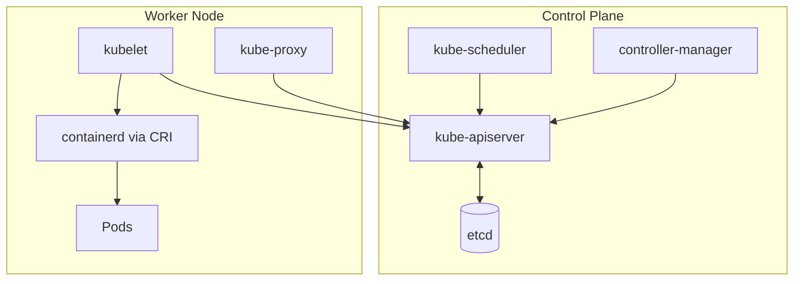
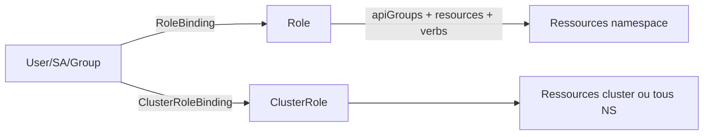

# 01 — Cluster Architecture, Installation & Configuration

> **CKA — 25 %** · Domaine le plus large. Inclut RBAC, kubeadm, HA, CRI, extensions.

## 🎯 Objectifs de l'exam

- Gérer les rôles RBAC (`Role`, `ClusterRole`, `RoleBinding`, `ClusterRoleBinding`) et les `ServiceAccount`
- Comprendre l'architecture d'un cluster K8s (control plane + workers)
- Installer un cluster HA avec `kubeadm`
- Faire évoluer un cluster (upgrade avec `kubeadm upgrade`)
- Implémenter et configurer un cluster HA (multi-control-plane)
- Gérer les extensions (CRI, CNI, CSI, Device Plugins, `CRD`)

## 🧠 Concepts clés

### Composants du control plane

| Composant | Rôle | Port | Static Pod ? |
|---|---|---|---|
| `kube-apiserver` | API REST, gateway unique du cluster | 6443 | ✅ |
| `etcd` | Store clé-valeur (state du cluster, JSON encodés) | 2379 (client) / 2380 (peer) | ✅ |
| `kube-scheduler` | Attribue les Pods aux Nodes | 10259 | ✅ |
| `kube-controller-manager` | Boucles de contrôle (Node, Deployment, Endpoint…) | 10257 | ✅ |
| `cloud-controller-manager` | Intégration cloud (LB, volumes) | 10258 | optionnel |

> 📝 **controller-manager en détail** : daemon de **boucles de réconciliation** (reconciliation loops). Il compare en continu l'état *courant* (lu via l'apiserver) à l'état *désiré* et déclenche le controller adéquat (Node, ReplicaSet, Endpoint, Namespace…) pour combler l'écart. Un seul binaire = plusieurs dizaines de controllers.
>
> ☁️ **cloud-controller-manager (CCM)** — beta en **v1.11**. Sépare la logique *cloud-specific* (LB, volumes, routes, node lifecycle) du kube-controller-manager, pour que les providers évoluent sans toucher au cœur de K8s.
> - Activation : chaque **kubelet** doit tourner avec `--cloud-provider=external`.
> - Absent d'un cluster kubeadm nu (donc **pas à l'exam**) ; sur EKS/GKE/AKS il est **géré par le provider**, invisible pour toi.

> 🔁 **Controller / operator** = boucle qui réconcilie **état actuel ↔ état désiré**. Base du modèle **déclaratif** : tu décris le résultat voulu, le controller le maintient en continu.
> - Layering : **Deployment → ReplicaSet → Pods** (chaque niveau a son controller). Supprimer un Pod → recréé par le RS ; il faut supprimer le **Deployment** pour tout retirer.
> - *Internals (Informer, DeltaFIFO, workqueue…) = culture dev, hors CKA.*

#### Managed vs self-managed — impact sur la visibilité

| Cluster | CP visible via `kubectl get nodes` | Accès `crictl` au CP | Upgrade path |
|---|---|---|---|
| **kubeadm** (CKA exam) | ✅ | ✅ SSH | `kubeadm upgrade` |
| **EKS / GKE / AKS** | ❌ | ❌ | API cloud (`aws eks update-cluster-version`…) |
| **kind / minikube / k3s** | ✅ | ✅ (dans le container) | Recréation du cluster |

> ⚠️ L'exam CKA utilise **exclusivement kubeadm**. Environ **40 %** des points portent sur des tâches CP (upgrade, etcd, static pods, certs) **impossibles à pratiquer sur EKS**. Monte un cluster kubeadm local pour t'entraîner.

### Composants d'un worker

| Composant | Rôle |
|---|---|
| `kubelet` | Agent sur chaque node ; parle à l'API server ; exécute les Pods via CRI |
| `kube-proxy` | Programme iptables/IPVS/nftables pour les Services |
| **Container Runtime** | `containerd` (par défaut), `CRI-O`. **Plus de Docker depuis 1.24** |

> 💡 **Version 1.24+** : `dockershim` supprimé. Le runtime doit implémenter directement l'interface **CRI**.
> 💡 **Version 1.29+** : `kube-proxy` supporte le mode `nftables` (stable en 1.31).

> 📝 **kubelet en détail** : reçoit la **PodSpec** (YAML/JSON du Pod désiré) via l'apiserver et met le node **en conformité** avec cette spec :
> - orchestre la création des conteneurs (via CRI),
> - monte les **volumes** de stockage,
> - injecte les **Secrets / ConfigMaps**,
> - remonte en continu l'**état** des Pods et du node à l'apiserver (heartbeat).
>
> Il ne gère **que** les Pods qui lui sont assignés (ceux dont `nodeName` = son node) + les **static pods** de `/etc/kubernetes/manifests/`.
>
> 🔬 **Topology Manager** (culture) : composant interne du kubelet qui aligne l'allocation CPU / accélérateurs matériels sur la topologie **NUMA** du node, pour de meilleures perfs sur charges sensibles. Pas de tâche CKA dessus.



> 💡 **Modèle « hub-and-spoke » (tout passe par l'apiserver)** :
> - Le `kube-apiserver` est le **seul** composant à parler à **etcd** → source de vérité unique.
> - Tous les autres (kubelet, scheduler, controller-manager, agents CNI type Cilium) communiquent **uniquement via l'API**, jamais entre eux directement.
> - Avantage : cohérence + sécurité + un seul point de contrôle (authn/authz/audit centralisés).
> - **Corollaire exam** : `apiserver` down → plus rien ne bouge (ni `kubectl`, ni reconciliation, ni scheduling). C'est le premier suspect dans un control plane en panne.

### Add-ons & agents réseau

Au-delà des composants « core », un cluster fait tourner des **add-ons** (souvent des Pods dans `kube-system`) :

| Add-on | Rôle | Note exam |
|---|---|---|
| **CoreDNS** | DNS interne : résout `<svc>.<ns>.svc.cluster.local`. **Remplace kube-dns** (défaut depuis 1.13). Architecture **modulaire à plugins** (cache, filtrage, forward…). | ⭐ Souvent la cause d'un « service injoignable par nom » (cf. Q17). |
| **Agents CNI** | Selon le plugin (Calico, Cilium, Flannel…), des Pods gèrent le routage, l'IPAM et l'application des **NetworkPolicy**. | Flannel **n'applique pas** les NetPol ; Calico/Cilium oui. |
| **kube-proxy** | Programme iptables/IPVS/nftables pour les Services (souvent un DaemonSet). | Déjà couvert côté worker. |
| **Logging (ex. Fluentd)** | K8s n'a **pas** de logging cluster-wide intégré. Une solution externe (Fluentd — projet CNCF, souvent en DaemonSet) collecte les logs des Pods/nodes, filtre, bufferise et route vers un stockage/analyse. | Culture. À l'exam : les logs se lisent avec `kubectl logs` / `crictl logs`, pas d'agrégateur. |
| **metrics-server** | Add-on SIG : expose CPU/mémoire **de base** des nodes et Pods via l'API `metrics.k8s.io`. **Alimente `kubectl top nodes/pods`** et l'autoscaling HPA. | ⭐ `kubectl top` renvoie une erreur si metrics-server n'est pas installé. |
| **Prometheus (+ Grafana)** | Monitoring détaillé en **time-series** (CNCF), bien au-delà de metrics-server. Grafana pour la visualisation. | Culture — pas de tâche CKA. |

> 💡 CoreDNS tourne en **Deployment** (répliqué), exposé par le Service `kube-dns` dans `kube-system`. Debug : `kubectl -n kube-system get pods -l k8s-app=kube-dns` + `kubectl -n kube-system logs -l k8s-app=kube-dns`.

### Object model

- **Ressource** : type d'objet (`Pod`, `Deployment`…) exposé par l'API. Groupée par **API group** (`core`, `apps`, `networking.k8s.io`…).
- **Version d'API** : chaque group porte des versions (`v1`, `v1beta1`…) qui **évoluent indépendamment**. Un objet s'écrit `apiVersion: <group>/<version>` (ex: `apps/v1`) — le group `core` s'écrit juste `v1`.
- **Namespace** : partition logique. Ressources cluster-scoped (`Node`, `PersistentVolume`, `ClusterRole`) hors namespace.

> 📝 **Les 4 namespaces créés à l'init** :
> | Namespace | Rôle |
> |---|---|
> | `default` | Ressources sans namespace explicite. |
> | `kube-system` | Composants système (CoreDNS, kube-proxy, CNI, controllers…). |
> | `kube-node-lease` | Objets `Lease` des nodes (heartbeat rapide → santé node, cf. Q4). |
> | `kube-public` | **Lisible sans authentification** — infos publiques du cluster (ex: `cluster-info`). Rarement utilisé. |
>
> Ressources **cluster-scoped** (Node, PV, ClusterRole, Namespace lui-même) n'appartiennent à **aucun** namespace. `kubectl api-resources --namespaced=false` les liste.

- **Labels vs annotations** : labels = selectors (indexés), annotations = metadata libre non-indexée.
- **Finalizers** : bloquent la suppression tant qu'ils ne sont pas retirés.

> ⚠️ **Dépréciation** : une API dépréciée finit **retirée** (ex: `extensions/v1beta1` Ingress/Deployment supprimés en 1.16 ; `policy/v1beta1` PodSecurityPolicy en 1.25). Un manifest sur une version morte → `no matches for kind ... in version ...`. Réflexes : `kubectl api-versions` (versions servies par **ce** cluster), `kubectl explain <res>` (montre la version courante), et **`kubectl convert -f old.yaml`** (plugin) pour migrer un YAML. À vérifier **avant tout upgrade**.

> 📊 **Niveaux de maturité API** :
> | Niveau | Version | Activé par défaut ? | Compat garantie ? |
> |---|---|---|---|
> | **Alpha** | `v1alpha1` | ❌ (feature-gate à activer) | Non — peut disparaître, buggé, test only |
> | **Beta** | `v1beta1` | ⚠️ variable (voir ci-dessous) | Partielle |
> | **Stable** | `v1` | ✅ | ✅ prod-ready |
>
> Le suffixe se lit dans l'`apiVersion` : `v1` (stable) → `apps/v1` ; `v1beta1` → `flowcontrol.apiserver.k8s.io/v1beta1`.
> Nuance : « beta enabled by default » ne vaut que pour les **anciennes** beta APIs ; depuis **K8s 1.24**, les **nouvelles** beta APIs sont **désactivées** par défaut.

### RBAC



- `Role` = namespace-scoped ; `ClusterRole` = cluster-scoped
- Un `RoleBinding` peut référencer un `ClusterRole` (utile pour donner des perms de type "admin" dans un seul namespace)
- **Verbs** courants : `get, list, watch, create, update, patch, delete, deletecollection`
- **ServiceAccount** par défaut : `default` dans chaque namespace, **peu de droits**. Créer un SA dédié par app.

> ⚠️ Point examinable : depuis 1.24, les Secrets de type `kubernetes.io/service-account-token` ne sont **plus créés automatiquement** pour les SA. Utiliser `kubectl create token <sa>` (durée courte) ou créer un Secret manuellement avec l'annotation.

### Considérations d'installation (checklist pré-déploiement)

Avant de lancer `kubeadm init`, 5 décisions structurantes (LFS258) :

| Décision | Options | Impact CKA |
|---|---|---|
| **Où héberger ?** | Public cloud / private cloud / on-premises · nodes physiques ou VM | Détermine le provisioning ; l'exam = VM kubeadm |
| **OS des nodes** | Debian, Ubuntu, CentOS Stream, ou *container-optimized* (Fedora CoreOS, RHEL CoreOS) | Ubuntu = le plus courant en exam/lab |
| **Networking / CNI** | Besoin d'un **overlay** (VXLAN) pour le trafic pod-to-pod ? | Choix du CNI (Calico, Flannel…) ; overlay = simple mais +latence |
| **Emplacement etcd** | **External** / **stacked** (colocalisé sur CP) / **embedded** | Voir HA ci-dessous ; stacked = défaut kubeadm |
| **HA du control plane ?** | Oui/non → failover + redondance | Multi-CP + LB en façade ; quorum etcd impair |

> 💡 **Overlay vs non-overlay** :
> - **Overlay** (VXLAN/IPIP) : encapsule le trafic pod → marche partout, même sans contrôle du réseau sous-jacent. Léger surcoût CPU/latence. (Flannel VXLAN, Calico VXLAN)
> - **Non-overlay / natif** (BGP) : route les IP de pods directement sur le réseau → meilleures perfs, mais demande un réseau qui coopère (BGP). (Calico BGP, kube-router)

### HA — Stacked vs external etcd

| Topologie | etcd | Nb nodes CP min | Fault tolerance |
|---|---|---|---|
| **Stacked** | Sur les nodes CP | 3 | 1 (quorum 2/3) |
| **External** | Cluster etcd séparé | 3 CP + 3 etcd | 1 chacun |

- **Quorum etcd** = `(N/2) + 1`. Toujours un **nombre impair** de membres (3, 5, 7).
- Recommandation prod : **5 membres etcd** (tolère 2 pertes).

### CRI · CNI · CSI · Device Plugins

| Interface | Rôle | Exemples |
|---|---|---|
| **CRI** | Runtime containers | containerd, CRI-O |
| **CNI** | Réseau des Pods | Calico, Cilium, Flannel, Weave |
| **CSI** | Storage | AWS EBS, Ceph, NFS, Longhorn |
| **Device Plugin** | Hardware (GPU, FPGA) | NVIDIA, Intel |

> 💡 **CRI & OCI** : le runtime doit implémenter l'interface **CRI** (côté kubelet) et respecter les standards **OCI** (format d'image + runtime). Tout runtime OCI-compliant est supporté.
> - Le runtime gère le **bas niveau** : pull des images, cycle de vie des conteneurs, remontée des **métriques** au kubelet.
> - Chaque node peut *théoriquement* utiliser un **runtime différent** (containerd sur l'un, CRI-O sur l'autre) tant qu'il est CRI-compliant — rare en pratique, mais possible.

## 📋 Commandes essentielles

```bash
# --- Cluster info ---
kubectl cluster-info
kubectl cluster-info dump | less
kubectl get componentstatuses           # deprecated mais encore utile
kubectl version --short
kubectl api-resources                   # toutes les ressources
kubectl api-versions                    # groups + versions
kubectl explain deploy.spec.template.spec.containers --recursive

# api-resources affiche : SHORTNAMES (ep, svc, deploy...) · APIVERSION · NAMESPACED · VERBS
#   kubectl api-resources --namespaced=false        # ressources cluster-scoped
#   kubectl api-resources --api-group=apps -o wide  # + colonne VERBS

# --- Nodes ---
kubectl get nodes -o wide
kubectl describe node <name>
kubectl top node                        # requiert metrics-server

# Compter/lister les control plane nodes (self-managed uniquement)
kubectl get nodes -l node-role.kubernetes.io/control-plane
kubectl get nodes -l node-role.kubernetes.io/control-plane --no-headers | wc -l
# ⚠️ Retourne 0 sur EKS/GKE/AKS : le CP est géré par le cloud, invisible via kubectl
# Vérifier le type de cluster :
kubectl cluster-info                    # endpoint = *.eks.amazonaws.com etc. si managed
kubectl version | grep -iE 'eks|gke|aks'  # tag flavor dans server version
# Alternative diagnostic self-managed (via static pod apiserver) :
kubectl -n kube-system get pods -o wide -l component=kube-apiserver

# --- Contextes ---
kubectl config view
kubectl config get-contexts
kubectl config use-context <name>
kubectl config set-context --current --namespace=<ns>

# --- RBAC ---
kubectl create sa deploy-bot -n prod
kubectl create role dev --verb=get,list,watch --resource=pods -n dev
kubectl create rolebinding dev-bind --role=dev --serviceaccount=dev:deploy-bot -n dev
kubectl create clusterrole nodes-ro --verb=get,list --resource=nodes
kubectl create clusterrolebinding view-nodes --clusterrole=nodes-ro --user=alice
kubectl auth can-i list pods --as=system:serviceaccount:dev:deploy-bot -n dev
kubectl auth whoami                     # 1.28+

# --- kubeadm ---
kubeadm init --control-plane-endpoint=lb.example:6443 --upload-certs \
  --pod-network-cidr=10.244.0.0/16
kubeadm token create --print-join-command
kubeadm certs check-expiration
kubeadm certs renew all
kubeadm upgrade plan
kubeadm upgrade apply v1.35.x
kubeadm reset -f                        # nettoyage total

# --- Static pods (control plane) ---
ls /etc/kubernetes/manifests/           # apiserver, etcd, scheduler, cm
# Modifier un fichier = kubelet recréé le static pod automatiquement

# --- Extensions ---
kubectl get crd
kubectl api-resources --api-group=apiextensions.k8s.io
```

## 📄 YAML de référence

```yaml
# Role + RoleBinding pour un SA
apiVersion: v1
kind: ServiceAccount
metadata: { name: deploy-bot, namespace: prod }
---
apiVersion: rbac.authorization.k8s.io/v1
kind: Role
metadata: { name: deploy-manager, namespace: prod }
rules:
- apiGroups: ["apps"]
  resources: ["deployments"]
  verbs: ["get", "list", "watch", "update", "patch"]
- apiGroups: [""]
  resources: ["pods", "pods/log"]
  verbs: ["get", "list", "watch"]
---
apiVersion: rbac.authorization.k8s.io/v1
kind: RoleBinding
metadata: { name: deploy-bot-binds, namespace: prod }
subjects:
- kind: ServiceAccount
  name: deploy-bot
  namespace: prod
roleRef:
  kind: Role
  name: deploy-manager
  apiGroup: rbac.authorization.k8s.io
```

```yaml
# ClusterRole aggregation (aggregate-to-admin pattern)
apiVersion: rbac.authorization.k8s.io/v1
kind: ClusterRole
metadata:
  name: monitoring-viewer
  labels:
    rbac.authorization.k8s.io/aggregate-to-view: "true"   # rejoint le CR "view"
rules:
- apiGroups: ["monitoring.coreos.com"]
  resources: ["prometheuses", "servicemonitors"]
  verbs: ["get", "list", "watch"]
```

```yaml
# kubeadm-config.yaml (init HA)
apiVersion: kubeadm.k8s.io/v1beta4
kind: ClusterConfiguration
kubernetesVersion: v1.35.0
controlPlaneEndpoint: "lb.example.com:6443"
networking:
  podSubnet: "10.244.0.0/16"
  serviceSubnet: "10.96.0.0/12"
etcd:
  local:
    dataDir: /var/lib/etcd
---
apiVersion: kubelet.config.k8s.io/v1beta1
kind: KubeletConfiguration
cgroupDriver: systemd     # doit correspondre au runtime (containerd)
```

## ⚠️ Pièges fréquents

### kubeadm / installation
- **`cgroupDriver` incohérent** entre kubelet et containerd → kubelet ne démarre pas. Utiliser `systemd` des deux côtés.
- **Swap activé** → kubelet refuse de démarrer. `swapoff -a` + retirer de `/etc/fstab` (ou `--fail-swap-on=false`, K8s 1.28+ swap supporté).
- **`br_netfilter` non chargé** → NetworkPolicy KO. `modprobe br_netfilter` + `sysctl net.bridge.bridge-nf-call-iptables=1`.
- Oublier `--upload-certs` en init HA → jointure des CP secondaires impossible.

### RBAC
- `RoleBinding` référençant un `ClusterRole` → droits **limités au namespace du RB**.
- SA sans `automountServiceAccountToken: false` sur workloads sans besoin d'API → surface d'attaque.
- `system:` prefix → **réservé K8s**. Ne pas créer d'objets avec ce préfixe.

### Certificats
- Certs kubeadm **expirent après 1 an**. `kubeadm upgrade` les renouvelle automatiquement, sinon `kubeadm certs renew all` + restart kubelet.
- Le cert du kubelet lui-même peut être auto-rotaté (`rotateCertificates: true` dans `KubeletConfiguration`).

### etcd
- Perte de **quorum** = cluster read-only. Toujours **3+ membres impairs**.
- Ne **jamais** sauvegarder pendant un `defrag` en cours.

## 🔗 Docs officielles autorisées

- [Concepts / Overview](https://kubernetes.io/docs/concepts/overview/components/)
- [RBAC Authorization](https://kubernetes.io/docs/reference/access-authn-authz/rbac/)
- [kubeadm reference](https://kubernetes.io/docs/reference/setup-tools/kubeadm/)
- [Upgrading kubeadm clusters](https://kubernetes.io/docs/tasks/administer-cluster/kubeadm/kubeadm-upgrade/)
- [Certificate management with kubeadm](https://kubernetes.io/docs/tasks/administer-cluster/kubeadm/kubeadm-certs/)
- [Operating etcd clusters](https://kubernetes.io/docs/tasks/administer-cluster/configure-upgrade-etcd/)
- [Container Runtimes](https://kubernetes.io/docs/setup/production-environment/container-runtimes/)
