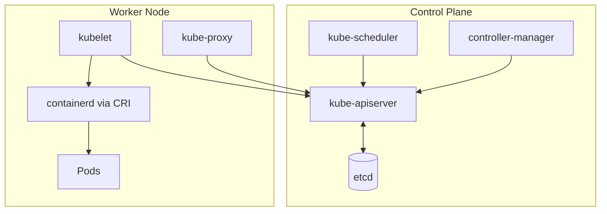
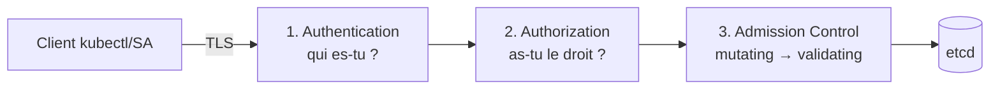
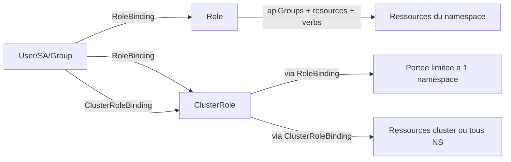

# 01 — Cluster Architecture, Installation & Configuration

> **CKA — 25 %** · Domaine le plus large. Inclut RBAC, kubeadm, HA, CRI, extensions.

<details>
<summary>📑 Sommaire</summary>

- [🎯 Objectifs de l'exam](#-objectifs-de-lexam)
- [🧠 Concepts clés](#-concepts-clés)
  - [Considérations d'installation (checklist pré-déploiement)](#considérations-dinstallation-checklist-pré-déploiement)
  - [HA — Stacked vs external etcd](#ha--stacked-vs-external-etcd)
  - [CRI · CNI · CSI · Device Plugins](#cri--cni--csi--device-plugins)
  - [Composants du control plane](#composants-du-control-plane)
  - [Composants d'un worker](#composants-dun-worker)
  - [Add-ons & agents réseau](#add-ons--agents-réseau)
  - [Object model](#object-model)
  - [Accès à l'API — pipeline de requête](#accès-à-lapi--pipeline-de-requête)
  - [RBAC](#rbac)
  - [CRD & Custom Resources](#crd--custom-resources)
- [📋 Commandes essentielles](#-commandes-essentielles)
- [📄 YAML de référence](#-yaml-de-référence)
- [⚠️ Pièges fréquents](#️-pièges-fréquents)
  - [kubeadm / installation](#kubeadm--installation)
  - [RBAC](#rbac-1)
  - [Certificats](#certificats)
  - [etcd](#etcd)
  - [🔒 Encryption at rest des Secrets (etcd)](#-encryption-at-rest-des-secrets-etcd)
- [🔗 Docs officielles autorisées](#-docs-officielles-autorisées)

</details>

## 🎯 Objectifs de l'exam

- Gérer les rôles RBAC (`Role`, `ClusterRole`, `RoleBinding`, `ClusterRoleBinding`) et les `ServiceAccount`
- Comprendre l'architecture d'un cluster K8s (control plane + workers)
- Installer un cluster HA avec `kubeadm`
- Faire évoluer un cluster (upgrade avec `kubeadm upgrade`)
- Implémenter et configurer un cluster HA (multi-control-plane)
- Gérer les extensions (CRI, CNI, CSI, Device Plugins, `CRD`)

## 🧠 Concepts clés

### Considérations d'installation (checklist pré-déploiement)

Avant de lancer `kubeadm init`, 5 décisions structurantes (LFS258) :

| Décision | Options | Impact CKA |
|---|---|---|
| **Où héberger ?** | Public cloud / private cloud / on-premises · nodes physiques ou VM | Détermine le provisioning ; l'exam = VM kubeadm |
| **OS des nodes** | Debian, Ubuntu, CentOS Stream, ou *container-optimized* (Fedora CoreOS, RHEL CoreOS) | Ubuntu = le plus courant en exam/lab |
| **Networking / CNI** | Besoin d'un **overlay** (VXLAN) pour le trafic pod-to-pod ? | Choix du CNI (Calico, Flannel…) ; overlay = simple mais +latence |
| **Emplacement etcd** | **External** / **stacked** (colocalisé sur CP) / **embedded** | Voir HA ci-dessous ; stacked = défaut kubeadm |
| **HA du control plane ?** | Oui/non → failover + redondance | Multi-CP + LB en façade ; quorum etcd impair |

> 💡 **Overlay vs non-overlay** :
> - **Overlay** (VXLAN/IPIP) : encapsule le trafic pod → marche partout, même sans contrôle du réseau sous-jacent. Léger surcoût CPU/latence. (Flannel VXLAN, Calico VXLAN)
> - **Non-overlay / natif** (BGP) : route les IP de pods directement sur le réseau → meilleures perfs, mais demande un réseau qui coopère (BGP). (Calico BGP, kube-router)

### HA — Stacked vs external etcd

| Topologie | etcd | Nb nodes CP min | Fault tolerance |
|---|---|---|---|
| **Stacked** | Sur les nodes CP | 3 | 1 (quorum 2/3) |
| **External** | Cluster etcd séparé | 3 CP + 3 etcd | 1 chacun |

- **Quorum etcd** = `(N/2) + 1`. Toujours un **nombre impair** de membres (3, 5, 7).
- Recommandation prod : **5 membres etcd** (tolère 2 pertes).
- **LB en façade** des apiservers = **L4 / TCP pass-through** (HAProxy/nginx en mode TCP), **pas** L7 avec terminaison TLS — l'apiserver gère lui-même la mTLS. Adresse du LB = `controlPlaneEndpoint`.

### CRI · CNI · CSI · Device Plugins

| Interface | Rôle | Exemples |
|---|---|---|
| **CRI** | Runtime containers | containerd, CRI-O |
| **CNI** | Réseau des Pods | Calico, Cilium, Flannel, Weave |
| **CSI** | Storage | AWS EBS, Ceph, NFS, Longhorn |
| **Device Plugin** | Hardware (GPU, FPGA) | NVIDIA, Intel |

> 💡 **CRI & OCI** : le runtime doit implémenter l'interface **CRI** (côté kubelet) et respecter les standards **OCI** (format d'image + runtime). Tout runtime OCI-compliant est supporté.
> - Le runtime gère le **bas niveau** : pull des images, cycle de vie des conteneurs, remontée des **métriques** au kubelet.
> - Chaque node peut *théoriquement* utiliser un **runtime différent** (containerd sur l'un, CRI-O sur l'autre) tant qu'il est CRI-compliant — rare en pratique, mais possible.

### Composants du control plane

| Composant | Rôle | Port | Static Pod ? |
|---|---|---|---|
| `kube-apiserver` | API REST, gateway unique du cluster | 6443 | ✅ |
| `etcd` | Store clé-valeur (state du cluster, JSON encodés) | 2379 (client) / 2380 (peer) | ✅ si stacked |
| `kube-scheduler` | Attribue les Pods aux Nodes | 10259 | ✅ |
| `kube-controller-manager` | Boucles de contrôle (Node, Deployment, Endpoint…) | 10257 | ✅ |
| `cloud-controller-manager` | Intégration cloud (LB, volumes) | 10258 | optionnel |

> 📝 **controller-manager en détail** : daemon de **boucles de réconciliation** (reconciliation loops). Il compare en continu l'état *courant* (lu via l'apiserver) à l'état *désiré* et déclenche le controller adéquat (Node, ReplicaSet, Endpoint, Namespace…) pour combler l'écart. Un seul binaire = plusieurs dizaines de controllers.

> ☁️ **cloud-controller-manager (CCM)** — beta en **v1.11**. Sépare la logique *cloud-specific* (LB, volumes, routes, node lifecycle) du kube-controller-manager, pour que les providers évoluent sans toucher au cœur de K8s.
> - Activation : chaque **kubelet** doit tourner avec `--cloud-provider=external`.
> - Absent d'un cluster kubeadm nu (donc **pas à l'exam**) ; sur EKS/GKE/AKS il est **géré par le provider**, invisible pour toi.

> 🔁 **Controller / operator** = boucle qui réconcilie **état actuel ↔ état désiré**. Base du modèle **déclaratif** : tu décris le résultat voulu, le controller le maintient en continu.
> - Layering : **Deployment → ReplicaSet → Pods** (chaque niveau a son controller). Supprimer un Pod → recréé par le RS ; il faut supprimer le **Deployment** pour tout retirer.
> - *Internals (Informer, DeltaFIFO, workqueue…) = culture dev, hors CKA.*

#### Managed vs self-managed — impact sur la visibilité

| Cluster | CP visible via `kubectl get nodes` | Accès `crictl` au CP | Upgrade path |
|---|---|---|---|
| **kubeadm** (CKA exam) | ✅ | ✅ SSH | `kubeadm upgrade` |
| **EKS / GKE / AKS** | ❌ | ❌ | API cloud (`aws eks update-cluster-version`…) |
| **kind / minikube / k3s** | ✅ | ✅ (dans le container) | Recréation du cluster |

> ⚠️ L'exam CKA utilise **exclusivement kubeadm**. Environ **40 %** des points portent sur des tâches CP (upgrade, etcd, static pods, certs) **impossibles à pratiquer sur EKS**. Monte un cluster kubeadm local pour t'entraîner.

### Composants d'un worker

| Composant | Rôle |
|---|---|
| `kubelet` | Agent sur chaque node ; parle à l'API server ; exécute les Pods via CRI |
| `kube-proxy` | Programme iptables/IPVS/nftables pour les Services |
| **Container Runtime** | `containerd` (par défaut), `CRI-O`. **Plus de Docker depuis 1.24** |

> 💡 **Version 1.24+** : `dockershim` supprimé. Le runtime doit implémenter directement l'interface **CRI**.
> 💡 **Version 1.29+** : `kube-proxy` supporte le mode `nftables` (alpha 1.29, beta 1.31, **GA 1.33**).

> 📝 **kubelet en détail** : reçoit la **PodSpec** (YAML/JSON du Pod désiré) via l'apiserver et met le node **en conformité** avec cette spec :
> - orchestre la création des conteneurs (via CRI),
> - monte les **volumes** de stockage,
> - injecte les **Secrets / ConfigMaps**,
> - remonte en continu l'**état** des Pods et du node à l'apiserver (heartbeat).
>
> Il ne gère **que** les Pods qui lui sont assignés (ceux dont `nodeName` = son node) + les **static pods** de `/etc/kubernetes/manifests/`.
>
> 🔬 **Topology Manager** (culture) : composant interne du kubelet qui aligne l'allocation CPU / accélérateurs matériels sur la topologie **NUMA** du node, pour de meilleures perfs sur charges sensibles. Pas de tâche CKA dessus.



> 💡 **Modèle « hub-and-spoke » (tout passe par l'apiserver)** :
> - Le `kube-apiserver` est le **seul** composant à parler à **etcd** → source de vérité unique.
> - Tous les autres (kubelet, scheduler, controller-manager, agents CNI type Cilium) communiquent **uniquement via l'API**, jamais entre eux directement.
> - Avantage : cohérence + sécurité + un seul point de contrôle (authn/authz/audit centralisés).
> - **Corollaire exam** : `apiserver` down → plus rien ne bouge (ni `kubectl`, ni reconciliation, ni scheduling). C'est le premier suspect dans un control plane en panne.

### Add-ons & agents réseau

Au-delà des composants « core », un cluster fait tourner des **add-ons** (souvent des Pods dans `kube-system`) :

| Add-on | Rôle | Note exam |
|---|---|---|
| **CoreDNS** | DNS interne : résout `<svc>.<ns>.svc.cluster.local`. **Remplace kube-dns** (défaut depuis 1.13). Architecture **modulaire à plugins** (cache, filtrage, forward…). | ⭐ Souvent la cause d'un « service injoignable par nom » (cf. [Q17](QUESTIONS-EXAMEN.md)). |
| **Agents CNI** | Selon le plugin (Calico, Cilium, Flannel…), des Pods gèrent le routage, l'IPAM et l'application des **NetworkPolicy**. | Flannel **n'applique pas** les NetPol ; Calico/Cilium oui. |
| **kube-proxy** | Programme iptables/IPVS/nftables pour les Services (souvent un DaemonSet). | Déjà couvert côté worker. |
| **Logging (ex. Fluentd)** | K8s n'a **pas** de logging cluster-wide intégré. Une solution externe (Fluentd — projet CNCF, souvent en DaemonSet) collecte les logs des Pods/nodes, filtre, bufferise et route vers un stockage/analyse. | Culture. À l'exam : les logs se lisent avec `kubectl logs` / `crictl logs`, pas d'agrégateur. |
| **metrics-server** | Add-on SIG : expose CPU/mémoire **de base** des nodes et Pods via l'API `metrics.k8s.io`. **Alimente `kubectl top nodes/pods`** et l'autoscaling HPA. | ⭐ `kubectl top` renvoie une erreur si metrics-server n'est pas installé. |
| **Prometheus (+ Grafana)** | Monitoring détaillé en **time-series** (CNCF), bien au-delà de metrics-server. Grafana pour la visualisation. | Culture — pas de tâche CKA. |

> 💡 CoreDNS tourne en **Deployment** (répliqué), exposé par le Service `kube-dns` dans `kube-system`. Debug : `kubectl -n kube-system get pods -l k8s-app=kube-dns` + `kubectl -n kube-system logs -l k8s-app=kube-dns`.

### Object model

- **Ressource** : type d'objet (`Pod`, `Deployment`…) exposé par l'API. Groupée par **API group** (`core`, `apps`, `networking.k8s.io`…).
- **Version d'API** : chaque group porte des versions (`v1`, `v1beta1`…) qui **évoluent indépendamment**. Un objet s'écrit `apiVersion: <group>/<version>` (ex: `apps/v1`) — le group `core` s'écrit juste `v1`.
- **Namespace** : partition logique. Ressources cluster-scoped (`Node`, `PersistentVolume`, `ClusterRole`) hors namespace.

> 📝 **Les 4 namespaces créés à l'init** :
> | Namespace | Rôle |
> |---|---|
> | `default` | Ressources sans namespace explicite. |
> | `kube-system` | Composants système (CoreDNS, kube-proxy, CNI, controllers…). |
> | `kube-node-lease` | Objets `Lease` des nodes (heartbeat rapide → santé node, cf. [Q4](QUESTIONS-EXAMEN.md)). |
> | `kube-public` | **Lisible sans authentification** — infos publiques du cluster (ex: `cluster-info`). Rarement utilisé. |
>
> Ressources **cluster-scoped** (Node, PV, ClusterRole, Namespace lui-même) n'appartiennent à **aucun** namespace. `kubectl api-resources --namespaced=false` les liste.

- **Labels vs annotations** : labels = selectors (indexés), annotations = metadata libre non-indexée.
- **Finalizers** : bloquent la suppression tant qu'ils ne sont pas retirés.

> ⚠️ **Dépréciation** : une API dépréciée finit **retirée** (ex: `extensions/v1beta1` Ingress/Deployment supprimés en 1.16 ; `policy/v1beta1` PodSecurityPolicy en 1.25). Un manifest sur une version morte → `no matches for kind ... in version ...`. Réflexes : `kubectl api-versions` (versions servies par **ce** cluster), `kubectl explain <res>` (montre la version courante), et **`kubectl convert -f old.yaml`** (plugin) pour migrer un YAML. À vérifier **avant tout upgrade**.

> 📊 **Niveaux de maturité API** :
> | Niveau | Version | Activé par défaut ? | Compat garantie ? |
> |---|---|---|---|
> | **Alpha** | `v1alpha1` | ❌ (feature-gate à activer) | Non — peut disparaître, buggé, test only |
> | **Beta** | `v1beta1` | ⚠️ variable (voir ci-dessous) | Partielle |
> | **Stable** | `v1` | ✅ | ✅ prod-ready |
>
> Le suffixe se lit dans l'`apiVersion` : `v1` (stable) → `apps/v1` ; `v1beta1` → `flowcontrol.apiserver.k8s.io/v1beta1`.
> Nuance : « beta enabled by default » ne vaut que pour les **anciennes** beta APIs ; depuis **K8s 1.24**, les **nouvelles** beta APIs sont **désactivées** par défaut.

### Accès à l'API — pipeline de requête

Toute requête au `kube-apiserver` passe par **3 étapes** (en **TLS**, certs gérés par kubeadm) :



1. **Authentication** — vérifie l'**identité**. Deux types de sujets : **normal users** (humains, gérés **hors** cluster : x509, OIDC, webhook) et **ServiceAccounts** (gérés **dans** K8s, pour les Pods/workloads). Modules essayés en séquence, premier succès gagne. ⚠️ Pas de « user object » natif. ⚠️ *basic auth / static password file* **supprimés en 1.19** — hors exam v1.35.
2. **Authorization** — vérifie les **droits** : **RBAC** (défaut kubeadm), aussi `Node`, `ABAC`, `Webhook`. Modules en chaîne → premier **allow** gagne, sinon deny.
3. **Admission Control** — valide/modifie la requête : **mutating** d'abord (peut réécrire, ex. injecter defaults), puis **validating** (accepte/rejette, ex. `PodSecurity`, `ResourceQuota`).

> 🔧 **Activer/désactiver un plugin d'admission** : flags `--enable-admission-plugins=` / `--disable-admission-plugins=` du `kube-apiserver`. En kubeadm = static Pod → éditer `/etc/kubernetes/manifests/kube-apiserver.yaml`, l'apiserver **redémarre automatiquement**.
>
> Plugins clés : `NamespaceLifecycle`, `LimitRanger`, `ResourceQuota`, `PodSecurity`, `MutatingAdmissionWebhook`, `ValidatingAdmissionWebhook`.
>
> Inspecter : `grep admission /etc/kubernetes/manifests/kube-apiserver.yaml`. **`NodeRestriction`** est activé **par défaut par kubeadm** (limite chaque kubelet à modifier seulement son propre Node + ses Pods).

> 🔑 **Ordre à retenir** : **AuthN → AuthZ → Admission → etcd**. Un `403 Forbidden` = échec AuthZ (RBAC) ; un `401 Unauthorized` = échec AuthN.

> 🔐 **Créer un « user » = émettre un cert client x509** (il n'existe **pas** d'objet User dans K8s — un user n'est que l'identité lue dans un cert authentifié) :
> - **Identité** : **`CN` (Common Name) = username**, **`O` (Organization) = group** (plusieurs `O` = plusieurs groups). Ex. `-subj "/CN=DevDan/O=development"` → user `DevDan`, groupe `development`.
> - **Deux façons de signer** : (1) **CSR API** (`CertificateSigningRequest` + `kubectl certificate approve`, cf. [Q18](QUESTIONS-EXAMEN.md)) — méthode « native » ; (2) **openssl direct** contre `/etc/kubernetes/pki/ca.{crt,key}` (`openssl x509 -req -CA ... -CAkey ...`) — plus rapide en lab.
>
> Ce cert = le **sujet** (`user`/`group`) que le `RoleBinding`/`ClusterRoleBinding` référencera ensuite pour l'autoriser (voir RBAC ci-dessous).

### RBAC



- `Role` = namespace-scoped ; `ClusterRole` = cluster-scoped
- Un `RoleBinding` peut référencer un `ClusterRole` (utile pour donner des perms de type "admin" dans un seul namespace)
- **RBAC est purement additif** : aucune règle de **deny**. Un sujet est autorisé s'il matche **≥ 1** règle `allow` (union de tous ses bindings) ; sinon refus par défaut. On ne « soustrait » jamais un droit — on ne l'accorde simplement pas.
- **Sujets** : un binding lie un droit à un `user`, un `group` ou un `ServiceAccount`. Les users/groups n'existent pas comme objets — ils proviennent de l'**AuthN** (cert x509 : `CN`=user, `O`=group). Voir *Accès à l'API* ci-dessus pour créer/signer un cert user.
- **ServiceAccount** par défaut : `default` dans chaque namespace, **peu de droits**. Créer un SA dédié par app.

#### Anatomie d'une règle : `apiGroups` × `resources` × `verbs`

Une entrée de `rules[]` est un **produit** de 3 listes : elle autorise **chaque `verb`** sur **chaque `resource`** appartenant à **chacun des `apiGroups`** cités. Les trois sont liés — une `resource` n'a de sens que **dans son apiGroup**.

```yaml
rules:
- apiGroups: ["apps"]              # QUEL groupe d'API
  resources: ["deployments"]       # QUEL type (doit vivre dans ce groupe)
  verbs: ["get", "list", "watch"]  # QUELLES actions
```

**Lien `apiGroups` ↔ `resources`** : chaque ressource vit dans **exactement un** apiGroup. L'`apiVersion` d'un manifest révèle le groupe → `apps/v1` = groupe `apps` ; **`v1` seul = core group**, qui s'écrit **`""` (chaîne vide)** dans un `Role`, jamais `"core"`.

| `apiGroups` | `apiVersion` du manifest | `resources` typiques |
|---|---|---|
| `""` (**core**) | `v1` | `pods`, `services`, `endpoints`, `secrets`, `configmaps`, `persistentvolumeclaims`, `serviceaccounts`, `nodes`, `namespaces` |
| `"apps"` | `apps/v1` | `deployments`, `replicasets`, `daemonsets`, `statefulsets` |
| `"batch"` | `batch/v1` | `jobs`, `cronjobs` |
| `"networking.k8s.io"` | `networking.k8s.io/v1` | `networkpolicies`, `ingresses` |
| `"rbac.authorization.k8s.io"` | `rbac.authorization.k8s.io/v1` | `roles`, `rolebindings`, `clusterroles`, `clusterrolebindings` |
| `"storage.k8s.io"` | `storage.k8s.io/v1` | `storageclasses`, `volumeattachments` |
| `"apiextensions.k8s.io"` | `apiextensions.k8s.io/v1` | `customresourcedefinitions` |

> 🔑 **Trouver le triplet** : `kubectl api-resources` donne les colonnes **APIVERSION** (→ apiGroup) · **NAME** (→ resource, au **pluriel**) · **VERBS**. Ex. `kubectl api-resources --api-group=apps -o wide`. Toujours le **pluriel** dans `resources` (`pods`, pas `Pod`).
> - **Sous-ressources** avec `/` : `pods/log`, `pods/exec`, `pods/portforward`, `deployments/scale`, `<cr>/status`. Le droit sur `pods` ne couvre **pas** `pods/log` → il faut l'ajouter explicitement.
> - `resources: ["*"]` / `apiGroups: ["*"]` / `verbs: ["*"]` = wildcard (large — à éviter hors cluster-admin).

**Verbs** — les actions accordées :

| Verbe | Action | Verbe HTTP |
|---|---|---|
| `get` | Lire **un** objet nommé | GET |
| `list` | Lister une **collection** ⚠️ renvoie le **contenu** des objets (dont les `secrets`) | GET |
| `watch` | Flux temps réel des changements | GET (stream) |
| `create` | Créer | POST |
| `update` | Remplacer entièrement | PUT |
| `patch` | Modifier partiellement | PATCH |
| `delete` | Supprimer un objet nommé | DELETE |
| `deletecollection` | Supprimer **en masse** (toute une collection) | DELETE |

> ⚠️ `list` ≠ `get` : accorder `list` sur `secrets` **révèle leur contenu**, pas juste leurs noms. Ne pas le donner à la légère.
> 💡 **Verbs spéciaux** (non-CRUD, sur des ressources précises) : `bind`/`escalate` (sur `roles`/`clusterroles`, pour empêcher l'élévation de privilèges), `impersonate` (sur `users`/`groups`/`serviceaccounts`), `approve` (sur `certificatesigningrequests`), `use` (sur les PSP/SCC).

> ⚠️ Point examinable : depuis 1.24, les Secrets de type `kubernetes.io/service-account-token` ne sont **plus créés automatiquement** pour les SA. Utiliser `kubectl create token <sa>` (durée courte) ou créer un Secret manuellement avec l'annotation.

### CRD & Custom Resources

> 🆕 **Examinable CKA depuis 2025** (« Understand CRDs, install and configure operators », domaine Cluster Architecture). Niveau **admin/opérateur** : installer et utiliser, **pas** coder un controller.

- **Custom Resource (CR)** = nouvel objet ajouté à l'API, stocké dans **etcd**, servi par le **kube-apiserver**, manipulé avec `kubectl` comme un objet natif.
- **2 façons d'étendre l'API** :
  - **CRD** (CustomResourceDefinition) : un simple YAML déclare un nouveau type. Simple, sans infra, le cas courant. ⭐ **C'est ce que teste le CKA.**
  - **Aggregated API** : un serveur d'API dédié branché sur le kube-apiserver. Très flexible mais lourd (dev + infra). **Savoir que ça existe**, pas plus.
- ⚠️ **RBAC** : une CRD ne donne **aucun droit** automatiquement. Il faut un `Role`/`ClusterRole` explicite sur le nouveau type (apiGroup de la CRD + `resources` = plural) pour que users/SA puissent l'utiliser.

  ```yaml
  # Role donnant accès au CR "backups" (group stable.linux.com)
  apiVersion: rbac.authorization.k8s.io/v1
  kind: Role
  metadata: { name: backup-editor, namespace: default }
  rules:
  - apiGroups: ["stable.linux.com"]   # = spec.group de la CRD, PAS apiextensions.k8s.io
    resources: ["backups"]            # = spec.names.plural (jamais le kind)
    verbs: ["get", "list", "watch", "create", "update", "patch", "delete"]
  # Sous-ressource éventuelle : resources: ["backups/status"] pour le status
  ```

  > 🔑 Deux pièges : (1) mettre `apiextensions.k8s.io` (group de la CRD) au lieu du group **du CR** → droits sur la définition, pas sur les instances ; (2) mettre le `kind` (`BackUp`) au lieu du **plural** (`backups`) dans `resources`. Gérer la CRD elle-même (create/delete la *définition*) = `apiGroups: ["apiextensions.k8s.io"]`, `resources: ["customresourcedefinitions"]` — cluster-scoped, donc `ClusterRole`.
- **La CRD elle-même** appartient au group **`apiextensions.k8s.io/v1`** (`kind: CustomResourceDefinition`). Ne pas confondre avec le group **du CR** que tu déclares (`spec.group`, ex. `stable.example.com`).
- **Champs clés d'un CRD** : `spec.group`, `spec.versions[]` (avec `schema` **OpenAPI v3** = validation des champs), `spec.scope` (**`Namespaced`** ou **`Cluster`**), `spec.names` (`kind`, `plural`, `singular`, `shortNames`).
- **Operator** = CRD **+** controller custom (reconcile loop qui watch les CR et agit). La CRD seule ne fait **rien** — elle déclare juste un type ; c'est le controller qui lui donne un comportement.

> 🔑 **Règle de nommage stricte** : `metadata.name` du CRD = **`<plural>.<group>`** (sinon rejet `metadata.name must be spec.names.plural+"."+spec.group`).

```yaml
apiVersion: apiextensions.k8s.io/v1
kind: CustomResourceDefinition
metadata:
  name: backups.stable.linux.com     # OBLIGATOIREMENT <plural>.<group>
spec:
  group: stable.linux.com
  scope: Namespaced                  # ou Cluster
  names:
    plural: backups
    singular: backup
    kind: BackUp                     # utilisé dans le YAML des CR
    shortNames: [bks]
  versions:
  - name: v1
    served: true                     # exposée par l'API ?
    storage: true                    # 1 seule version storage: true
    schema:
      openAPIV3Schema:
        type: object
        properties:
          spec:
            type: object
            properties:
              target: { type: string }
```

> 🔑 **Le CR (l'instance)** utilise `apiVersion: <group>/<version>` (`stable.linux.com/v1`) et `kind:` = `spec.names.kind` — **pas** `apiextensions.k8s.io/v1` (ça, c'est la CRD, pas le CR).

```yaml
apiVersion: stable.linux.com/v1    # <group>/<version> du CRD
kind: BackUp                       # = spec.names.kind
metadata:
  name: a-backup-object
  namespace: default               # car scope: Namespaced
spec:
  timeSpec: "*/5 * * * *"
  image: linux-backup-image
```

Validation : avec `schema` OpenAPI dans le CRD → K8s vérifie **type + format** (rejet si non conforme). Sans schema → vérifie seulement que les champs **existent**, erreurs reportées au controller.

> Mots-clés de contrainte OpenAPI dans le schema : `pattern` (regex), `minimum`/`maximum`, `enum`, `required`, `minLength`/`maxLength`. Validation OpenAPI v3 stable depuis **v1.16**.

**Réflexes CLI CRD/CR :**

```bash
kubectl get crd                          # lister les CRD (cluster-scoped)
kubectl describe crd crontabs.stable.example.com
kubectl create -f crd.yaml               # enregistre le type
kubectl get crontabs   # = kubectl get CronTab = kubectl get ct (plural/kind/shortName)
kubectl describe ct new-cron-object
```

> ⚠️ **`kubectl delete -f crd.yaml` supprime la CRD ET en cascade tous les CR de ce type** (tous les objets `CronTab`). Destruction massive silencieuse — attention en prod.

## 📋 Commandes essentielles

```bash
# --- Cluster info ---
kubectl cluster-info
kubectl cluster-info dump | less
kubectl get componentstatuses           # deprecated mais encore utile
kubectl version --short
kubectl api-resources                   # toutes les ressources
kubectl api-versions                    # groups + versions
kubectl explain deploy.spec.template.spec.containers --recursive

# api-resources affiche : SHORTNAMES (ep, svc, deploy...) · APIVERSION · NAMESPACED · VERBS
#   kubectl api-resources --namespaced=false        # ressources cluster-scoped
#   kubectl api-resources --api-group=apps -o wide  # + colonne VERBS

# --- Nodes ---
kubectl get nodes -o wide
kubectl describe node <name>
kubectl top node                        # requiert metrics-server

# Compter/lister les control plane nodes (self-managed uniquement)
kubectl get nodes -l node-role.kubernetes.io/control-plane
kubectl get nodes -l node-role.kubernetes.io/control-plane --no-headers | wc -l
# ⚠️ Retourne 0 sur EKS/GKE/AKS : le CP est géré par le cloud, invisible via kubectl
# Vérifier le type de cluster :
kubectl cluster-info                    # endpoint = *.eks.amazonaws.com etc. si managed
kubectl version | grep -iE 'eks|gke|aks'  # tag flavor dans server version
# Alternative diagnostic self-managed (via static pod apiserver) :
kubectl -n kube-system get pods -o wide -l component=kube-apiserver

# --- Contextes ---
kubectl config view
kubectl config get-contexts
kubectl config use-context <name>
kubectl config set-context --current --namespace=<ns>

# --- RBAC ---
kubectl create sa deploy-bot -n prod
kubectl create role dev --verb=get,list,watch --resource=pods -n dev
kubectl create rolebinding dev-bind --role=dev --serviceaccount=dev:deploy-bot -n dev
kubectl create clusterrole nodes-ro --verb=get,list --resource=nodes
kubectl create clusterrolebinding view-nodes --clusterrole=nodes-ro --user=alice
kubectl auth can-i list pods --as=system:serviceaccount:dev:deploy-bot -n dev
kubectl auth whoami                     # 1.28+

# --- kubeadm ---
kubeadm init --control-plane-endpoint=lb.example:6443 --upload-certs \
  --pod-network-cidr=10.244.0.0/16
kubeadm token create --print-join-command
kubeadm certs check-expiration
kubeadm certs renew all
kubeadm upgrade plan
kubeadm upgrade apply v1.35.x
kubeadm reset -f                        # nettoyage total

# --- Static pods (control plane) ---
ls /etc/kubernetes/manifests/           # apiserver, etcd, scheduler, cm
# Modifier un fichier = kubelet recréé le static pod automatiquement

# --- Extensions ---
kubectl get crd
kubectl api-resources --api-group=apiextensions.k8s.io
```

## 📄 YAML de référence

```yaml
# Role + RoleBinding pour un SA
apiVersion: v1
kind: ServiceAccount
metadata: { name: deploy-bot, namespace: prod }
---
apiVersion: rbac.authorization.k8s.io/v1
kind: Role
metadata: { name: deploy-manager, namespace: prod }
rules:
- apiGroups: ["apps"]
  resources: ["deployments"]
  verbs: ["get", "list", "watch", "update", "patch"]
- apiGroups: [""]
  resources: ["pods", "pods/log"]
  verbs: ["get", "list", "watch"]
---
apiVersion: rbac.authorization.k8s.io/v1
kind: RoleBinding
metadata: { name: deploy-bot-binds, namespace: prod }
subjects:
- kind: ServiceAccount
  name: deploy-bot
  namespace: prod
roleRef:
  kind: Role
  name: deploy-manager
  apiGroup: rbac.authorization.k8s.io
```

```yaml
# ClusterRole aggregation (aggregate-to-admin pattern)
apiVersion: rbac.authorization.k8s.io/v1
kind: ClusterRole
metadata:
  name: monitoring-viewer
  labels:
    rbac.authorization.k8s.io/aggregate-to-view: "true"   # rejoint le CR "view"
rules:
- apiGroups: ["monitoring.coreos.com"]
  resources: ["prometheuses", "servicemonitors"]
  verbs: ["get", "list", "watch"]
```

```yaml
# kubeadm-config.yaml (init HA)
apiVersion: kubeadm.k8s.io/v1beta4
kind: ClusterConfiguration
kubernetesVersion: v1.35.0
controlPlaneEndpoint: "lb.example.com:6443"
networking:
  podSubnet: "10.244.0.0/16"
  serviceSubnet: "10.96.0.0/12"
etcd:
  local:
    dataDir: /var/lib/etcd
# --- Variante EXTERNAL etcd (non-collocated) : remplace le bloc etcd.local ci-dessus ---
# etcd:
#   external:
#     endpoints:
#       - https://10.0.0.11:2379
#       - https://10.0.0.12:2379
#     caFile:   /etc/kubernetes/pki/etcd/ca.crt
#     certFile: /etc/kubernetes/pki/apiserver-etcd-client.crt
#     keyFile:  /etc/kubernetes/pki/apiserver-etcd-client.key
---
apiVersion: kubelet.config.k8s.io/v1beta1
kind: KubeletConfiguration
cgroupDriver: systemd     # doit correspondre au runtime (containerd)
```

## ⚠️ Pièges fréquents

### kubeadm / installation
- **`cgroupDriver` incohérent** entre kubelet et containerd → kubelet ne démarre pas. Utiliser `systemd` des deux côtés.
- **Swap activé** → kubelet refuse de démarrer. `swapoff -a` + retirer de `/etc/fstab` (ou `--fail-swap-on=false`, K8s 1.28+ swap supporté).
- **`br_netfilter` non chargé** → NetworkPolicy KO. `modprobe br_netfilter` + `sysctl net.bridge.bridge-nf-call-iptables=1`.
- Oublier `--upload-certs` en init HA → jointure des CP secondaires impossible.
- **Certificate key expirée (2 h)** : la clé qui chiffre les certs uploadés pour joindre un CP expire après **2 heures**. Au-delà → régénérer : `sudo kubeadm init phase upload-certs --upload-certs` (redonne une nouvelle `--certificate-key` à passer au `kubeadm join --control-plane`).

### RBAC
- `RoleBinding` référençant un `ClusterRole` → droits **limités au namespace du RB**.
- **Token SA monté par défaut** : chaque Pod reçoit automatiquement le token de son ServiceAccount dans `/var/run/secrets/...`. Pour un workload qui **ne parle pas** à l'API, ce token est une **surface d'attaque inutile** (un Pod compromis = token volé). → poser `automountServiceAccountToken: false` (sur le `ServiceAccount` ou dans la `spec` du Pod) pour ne pas le monter.
- `system:` prefix → **réservé K8s**. Ne pas créer d'objets avec ce préfixe.

### Certificats
- Certs kubeadm **expirent après 1 an**. `kubeadm upgrade` les renouvelle automatiquement, sinon `kubeadm certs renew all` + restart kubelet.
- Le cert du kubelet lui-même peut être auto-rotaté (`rotateCertificates: true` dans `KubeletConfiguration`).

### etcd
- Perte de **quorum** = cluster read-only. Toujours **3+ membres impairs**.
- Ne **jamais** sauvegarder pendant un `defrag` en cours.

### 🔒 Encryption at rest des Secrets (etcd)

Par défaut, les Secrets sont stockés **en clair** dans etcd (juste base64). Pour les chiffrer :

1. Créer un `EncryptionConfiguration` sur le **control-plane node** (ex : `/etc/kubernetes/enc/enc.yaml`) :
   ```yaml
   apiVersion: apiserver.config.k8s.io/v1
   kind: EncryptionConfiguration
   resources:
     - resources: [secrets]           # types à chiffrer
       providers:
         - aescbc:                     # 1er provider = celui qui CHIFFRE les writes
             keys:
               - name: key1
                 secret: <clé 32 octets en base64>   # head -c 32 /dev/urandom | base64
         - identity: {}               # fallback = pas de chiffrement (lecture legacy)
   ```
2. Ajouter au manifest **static pod** du kube-apiserver (`/etc/kubernetes/manifests/kube-apiserver.yaml`) :
   `--encryption-provider-config=/etc/kubernetes/enc/enc.yaml` + monter le volume hostPath. L'apiserver redémarre seul.
3. Ré-encrypter les Secrets **déjà présents** (le chiffrement n'agit qu'au write) :
   ```bash
   kubectl get secrets -A -o json | kubectl replace -f -
   ```

> 💡 **Ordre des providers = clé de la rotation** : le **premier** chiffre, **tous** sont essayés au déchiffrement. Rotation = mettre la nouvelle clé en tête → restart apiserver → re-`replace` tous les secrets → retirer l'ancienne clé.
> - `identity` en tête = **déchiffre tout en clair** (pour désactiver).
> - Providers : `identity` (aucun), `aescbc`, `aesgcm`, `secretbox`, `kms` v1/v2 (**recommandé prod**, ex : AWS KMS côté EKS).
> - Vérifier le chiffrement réel : `ETCDCTL_API=3 etcdctl get /registry/secrets/<ns>/<name>` → doit être illisible (préfixe `k8s:enc:aescbc:...`).

## 🔗 Docs officielles autorisées

- [Concepts / Overview](https://kubernetes.io/docs/concepts/overview/components/)
- [RBAC Authorization](https://kubernetes.io/docs/reference/access-authn-authz/rbac/)
- [kubeadm reference](https://kubernetes.io/docs/reference/setup-tools/kubeadm/)
- [Upgrading kubeadm clusters](https://kubernetes.io/docs/tasks/administer-cluster/kubeadm/kubeadm-upgrade/)
- [Certificate management with kubeadm](https://kubernetes.io/docs/tasks/administer-cluster/kubeadm/kubeadm-certs/)
- [Operating etcd clusters](https://kubernetes.io/docs/tasks/administer-cluster/configure-upgrade-etcd/)
- [Encrypting Secret Data at Rest](https://kubernetes.io/docs/tasks/administer-cluster/encrypt-data/)
- [Container Runtimes](https://kubernetes.io/docs/setup/production-environment/container-runtimes/)
