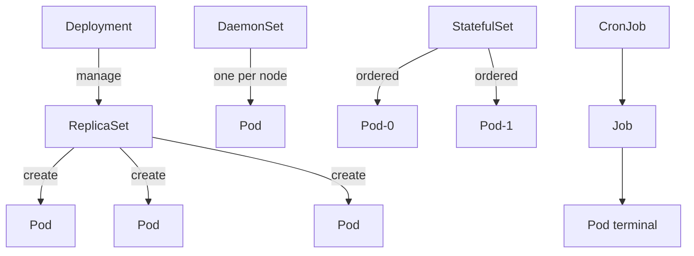
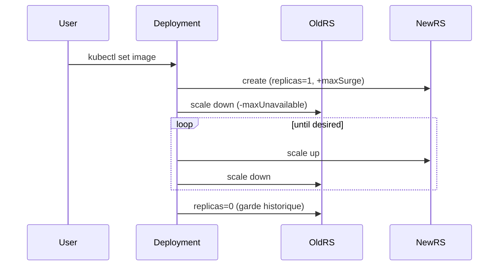

# 02 — Workloads & Scheduling

> **CKA — 15 %** · Deployments, ReplicaSets, DaemonSets, StatefulSets, Jobs, scheduling, autoscaling.

## 🎯 Objectifs de l'exam

- Comprendre les primitives de déploiement (rolling updates, rollbacks)
- Utiliser `ConfigMap`/`Secret` pour la config (angle CKA = cluster/admin)
- Connaître le sizing / `requests` / `limits` d'un workload
- Comprendre les concepts d'application self-healing et d'autoscaling (HPA)
- Gérer manifests et outils courants (Helm, Kustomize) — connaissance conceptuelle

## 🧠 Concepts clés

### Le Pod — unité de base

- **Plus petite unité déployable** de K8s (jamais un conteneur seul). Analogie « peas in a pod ».
- **1 IP par Pod**, partagée par tous ses conteneurs → ils communiquent via **`localhost`**, IPC ou un **volume partagé**.
- Design par défaut : **1 conteneur applicatif par Pod** (one-process-per-container).
- Les conteneurs d'un Pod **démarrent en parallèle** → **aucun ordre garanti**. Pour forcer une séquence (setup, migration…) → **`initContainers`** (s'exécutent l'un après l'autre, jusqu'au succès, **avant** les conteneurs principaux).
- **Patterns multi-conteneurs** (sidecar / ambassador / adapter) = des **rôles** de conception, **pas** des champs K8s :
  - **sidecar** : conteneur secondaire d'appui (log shipper, proxy) — cf. Q12.
  - **ambassador** : proxy vers un service externe.
  - **adapter** : normalise la sortie de l'app (ex: format de métriques).

> 💡 **Sidecar « natif »** (K8s 1.29+) = un `initContainer` avec `restartPolicy: Always` → démarre avant les conteneurs principaux **et** reste en vie tout le long.

> 💡 **initContainers — pattern « attendre une dépendance »** : run-to-completion, redémarrés jusqu'au succès, **bloquent** les conteneurs principaux tant qu'ils échouent.
> ```yaml
> spec:
>   initContainers:
>   - name: wait-db
>     image: busybox
>     command: ['sh','-c','until nc -z db 5432; do echo waiting; sleep 5; done']
>   containers:
>   - name: main-app
>     image: myapp
> ```
> Chaque `initContainer` a **ses propres** image, volumes et `securityContext` → il peut embarquer des outils absents de l'app et exécuter des tâches sensibles (perms élevées) sans les donner au conteneur principal.

### Hiérarchie des workloads



| Controller | Usage | Identité stable | Ordre |
|---|---|---|---|
| `Deployment` | Stateless apps | ❌ | ❌ |
| `ReplicaSet` | Bas niveau (rarement direct) | ❌ | ❌ |
| `StatefulSet` | Stateful (DB, cluster app) | ✅ (nom + volume) | ✅ |
| `DaemonSet` | 1 Pod par node (agents, CNI) | ❌ | ❌ |
| `Job` | Tâche batch qui se termine | ❌ | dépend |
| `CronJob` | Schedule Cron → Jobs | ❌ | — |

### ReplicaSet — orphelinage & adoption (label-driven)

Le lien **contrôleur ↔ Pod** se fait **par `selector` (labels)**, matérialisé par un `ownerReference` sur le Pod. D'où 3 manips examinables :

| Action | Commande / manip | Effet |
|---|---|---|
| **Orphaner** | `kubectl delete rs rs-one --cascade=orphan` | Supprime le RS, **garde les Pods** (non-disruptif). Vaut aussi pour Deployment/StatefulSet. |
| **Adopter** | recréer le RS avec **le même `selector`** | Le nouveau RS **ré-adopte** les Pods orphelins existants (pas de recréation). ⚠️ Ne met **pas** à jour l'image des Pods adoptés. |
| **Isoler** | `kubectl label pod <p> system=IsolatedPod --overwrite` (label ne matchant plus) | Le Pod **sort** du RS → le RS crée un **remplaçant** pour tenir `replicas`. Le Pod isolé survit. |

> **Pattern ops/exam** : pour debugger un Pod fautif sans interruption de service, **change son label** pour le sortir du contrôleur — le RS spawn un Pod sain à sa place, et tu gardes le malade intact pour l'autopsie.

**Options de `--cascade`** : `background` (défaut — supprime le contrôleur, GC supprime les Pods en tâche de fond), `foreground` (supprime les Pods **avant** le contrôleur), `orphan` (garde les Pods).

### Rolling update — Deployment

- `strategy.type` : `RollingUpdate` (défaut) ou `Recreate`
- `maxUnavailable` (25 %) et `maxSurge` (25 %) contrôlent la vitesse
- Historique via ReplicaSets successifs → **rollback** en un ordre



### StatefulSet — spécificités

- Nom des Pods : `web-0`, `web-1`, `web-N` (**ordinal stable**)
- Chaque Pod a son propre PVC (via `volumeClaimTemplates`)
- Nécessite un **Headless Service** (`clusterIP: None`) → DNS `web-0.web.default.svc.cluster.local`
- Ordre de création/suppression garanti (peut être relaxé avec `podManagementPolicy: Parallel`)

### Job / CronJob — spécificités

**Job** — exécute des Pods jusqu'à **succès**, puis s'arrête (pas long-running).

- `completions` : nombre de succès requis pour finir le Job (défaut 1)
- `parallelism` : nombre de Pods en parallèle (défaut 1)
- `backoffLimit` : nombre de retries avant de marquer le Job `Failed` (défaut 6)
- `activeDeadlineSeconds` : coupe le Job après N secondes quoi qu'il arrive (échec `reason: DeadlineExceeded`)
- `ttlSecondsAfterFinished` : supprime auto le Job **et ses Pods** N s après la fin (`Complete` ou `Failed`) ; `0` = immédiat, absent = jamais
- `restartPolicy` **obligatoire** : `Never` ou `OnFailure` (jamais `Always` dans un Job)
- Patterns : `completions=1/parallelism=1` = one-shot ; `completions=N/parallelism=M` = work queue

**CronJob** — crée des Jobs sur un **schedule cron** (`"0 3 * * *"`).

- `concurrencyPolicy` : `Allow` (défaut, chevauchement OK) · `Forbid` (saute si le précédent tourne encore) · `Replace` (tue le précédent)
- `startingDeadlineSeconds` : délai max pour lancer un Job manqué (sinon skip)
- `successfulJobsHistoryLimit` / `failedJobsHistoryLimit` : combien de vieux Jobs garder
- `suspend: true` : met en pause le scheduling

### DaemonSet — spécificités

- **1 Pod par node** (pas de champ `replicas`) ; ajout/suppression auto quand un node rejoint/quitte
- Placement via `nodeSelector` / `tolerations` / affinity ; pour tourner sur le control plane → **tolérer** `node-role.kubernetes.io/control-plane:NoSchedule` (cf. piège W3)
- `updateStrategy` : `RollingUpdate` (défaut) ou `OnDelete`
  - **RollingUpdate** : `maxUnavailable` (défaut **1**) **et** `maxSurge` (défaut **0**, GA depuis 1.25 — attention : Deployment a `maxSurge` **25 %** par défaut, le DS **0**). MàJ automatique, un node à la fois.
  - **OnDelete** : `set image` / `edit` **ne recrée pas** les Pods existants → l'admin doit `kubectl delete pod` chaque Pod pour que le remplaçant démarre avec la nouvelle image.
- Compatible `kubectl rollout` (status/history/undo) — **même sur OnDelete**, mais `undo`/`set image` ne changent que le **template** ; les Pods ne bougent qu'à leur suppression manuelle.

### Scheduling

**Cycle du kube-scheduler** (watch les Pods sans `nodeName`) :

1. **Filtering** (predicates) : écarte les nodes infaisables (ressources, taint non toléré, `nodeSelector`, `unschedulable`).
2. **Scoring** (priorities) : note les nodes restants → prend le meilleur.
3. **Binding** : écrit un objet `Binding` (= `pod.spec.nodeName`) sur l'API server → le **kubelet** du node crée les conteneurs.

- Aucun node faisable → Pod **`Pending`** + event `FailedScheduling` (`kubectl describe pod` / `get events`). Pas d'erreur bloquante, il attend.
- **`spec.schedulerName`** : utilise un scheduler custom au lieu du `default-scheduler` (multiple schedulers en parallèle).
  - ⚠️ Si le scheduler nommé **n'est pas déployé** → Pod `Pending` **sans event `FailedScheduling`** (aucun scheduler ne watch ce Pod). Diagnostic : vérifier `spec.schedulerName` (≠ Pending classique par manque de ressources, qui lui génère `FailedScheduling`).
- **Scheduling profiles** (`KubeSchedulerConfiguration`, via `--config`) : active/désactive des plugins de filtering/scoring et ajuste leurs poids, sans scheduler custom. Sur kubeadm le scheduler est un **static Pod** (`/etc/kubernetes/manifests/kube-scheduler.yaml`). Borderline CKA — connaître le terme suffit.

| Mécanisme | Sens | Portée |
|---|---|---|
| `nodeSelector` | Pod → Node (labels exacts) | Simple |
| `affinity.nodeAffinity` | Pod → Node (règles complexes, soft/hard) | Riche |
| `affinity.podAffinity/AntiAffinity` | Pod → Pod (co-localisation ou séparation) | Topology |
| `tolerations` + `taints` | Node repousse les Pods sauf tolérants | Réservation |
| `topologySpreadConstraints` | Répartition entre zones/hosts | HA |
| `priorityClassName` | Ordre de scheduling, préemption | Multi-workload |

**Taints — 3 effets** :
- `NoSchedule` : refuse nouveaux Pods
- `PreferNoSchedule` : évite si possible
- `NoExecute` : évince les Pods existants

- **`tolerationSeconds`** (seulement avec `NoExecute`) : le Pod toléré reste N secondes avant éviction (sans = immédiat).
- **Taint-based evictions** : le node-controller pose auto des taints `NoExecute` sur node malade (`node.kubernetes.io/not-ready`, `unreachable`, `disk-pressure`…) ; K8s injecte une toleration **300 s** par défaut → délai avant reschedule quand un node tombe. ⚠️ Ces évictions **ne respectent pas les PodDisruptionBudgets** (contrairement à `drain`).

Exemple : les control plane ont par défaut `node-role.kubernetes.io/control-plane:NoSchedule`.

**Affinity — `required` vs `preferred`** :
- `requiredDuringSchedulingIgnoredDuringExecution` = **hard** : obligatoire au scheduling, sinon Pod **`Pending`** (garantie).
- `preferredDuringSchedulingIgnoredDuringExecution` = **soft** : simple préférence (scoring), planifie ailleurs si besoin.
- `IgnoredDuringExecution` = évalué **au scheduling seulement** → changer les labels du node **après** ne réévince pas le Pod.

> 💡 Question piège : un Pod sans `tolerations` peut être planifié sur un node **cordoned** ? **Non** — `cordon` = `unschedulable=true`, complètement différent des taints.

> 🔑 **K8s ne rééquilibre jamais les Pods déjà planifiés.** Le scheduler n'agit qu'à la **création** : un Pod reste sur son node jusqu'à sa suppression, même si un meilleur node se libère (ex. retirer un taint `NoExecute` ne ramène pas les Pods évincés ; scale-up de nodes ne migre pas les Pods existants). Rééquilibrage = projet **`descheduler`** (opt-in, pas natif).

### Requests, limits, QoS

- `requests` = garantie de réservation (scheduling)
- `limits` = plafond (CPU throttle, mémoire → OOMKill)
- **Classes QoS** dérivées automatiquement :

| Classe | Condition |
|---|---|
| `Guaranteed` | `requests == limits` pour **tous** les containers CPU & mem |
| `Burstable` | requests < limits (au moins un) |
| `BestEffort` | aucune requests ni limits |

Priorité d'éviction : `BestEffort` > `Burstable` > `Guaranteed`.

> 💡 **Unités (case-sensitive !)** :
> - **CPU** : `1` = 1 cœur ; `500m` = 0,5 cœur (m = **milli**cpu). `0.5` == `500m`.
> - **Mémoire** : suffixes **binaires** `Ki`/`Mi`/`Gi` (1024) ou **décimaux** `K`/`M`/`G` (1000). `Mi` ≠ `mi` ≠ `M`.
> - Piège classique : `150mi` ou `256mb` → **rejeté/panic** (`unable to parse quantity's suffix`). La bonne forme = `150Mi`, `256Mi`.
> - Attention : `m` minuscule sur la **mémoire** = **milli-octets** (`500m` = 0,5 octet !) → jamais ce qu'on veut.
### securityContext (Pod & container)

Contrôle **qui/comment** tourne le process. Niveau **Pod** (`spec.securityContext`, s'applique à tous les containers) ou **container** (`spec.containers[].securityContext`, prioritaire).

| Champ | Effet |
|---|---|
| `runAsUser` / `runAsGroup` | UID/GID du process (ex. `runAsUser: 101` = user nginx) |
| `runAsNonRoot: true` | refuse le démarrage si l'image tourne en root → `CreateContainerConfigError` |
| `fsGroup` | GID propriétaire des volumes montés (fixe les perms d'écriture) |
| `allowPrivilegeEscalation: false` | bloque setuid/sudo dans le container |
| `readOnlyRootFilesystem: true` | FS racine en lecture seule |
| `capabilities` | `add`/`drop` de capabilities Linux (ex. `drop: ["ALL"]`) |

> 💡 Piège type (Domain Review #34) : un Pod crashe car nginx ne peut pas lire sa conf → `runAsUser: <uid nginx>`. `runAsNonRoot: true` **sans** `runAsUser` sur une image root = refus de démarrage.
### ResourceQuota & LimitRange (par namespace)

| Objet | Portée | Rôle |
|---|---|---|
| **ResourceQuota** | namespace | Plafond **global** du namespace : total CPU/mémoire, et **compte d'objets** (Pods, Services, PVC, Secrets…). Multi-tenant. |
| **LimitRange** | namespace | Valeurs **par conteneur/Pod** : `default`, `defaultRequest`, min, max. Injecte des requests/limits si le Pod n'en déclare pas. |

```yaml
apiVersion: v1
kind: ResourceQuota
metadata: { name: team-quota, namespace: dev }
spec:
  hard:
    requests.cpu: "4"
    requests.memory: 8Gi
    limits.cpu: "8"
    limits.memory: 16Gi
    pods: "20"
    persistentvolumeclaims: "5"
```

> ⚠️ **Piège** : si un `ResourceQuota` fixe `requests.cpu`/`limits.memory` sur le namespace, **tout** Pod créé **doit** déclarer les requests/limits correspondantes, sinon il est **refusé** (`forbidden: failed quota`). C'est là que `LimitRange` (valeurs par défaut) devient utile.
> 💡 `scopeSelector` : un quota peut ne s'appliquer qu'à certains Pods (ex: un `priorityClassName` donné) → politiques différenciées par priorité.
> Vérifier : `kubectl describe quota -n <ns>` (montre `Used / Hard`).

#### LimitRange — notes pratiques

Un `LimitRange` agit **par conteneur (ou par Pod/PVC)** au moment de l'admission. 4 leviers :

| Champ | Effet |
|---|---|
| `defaultRequest` | `requests` **injectées** si le conteneur n'en déclare pas |
| `default` | `limits` **injectées** si le conteneur n'en déclare pas |
| `min` | valeur **plancher** — un conteneur qui demande moins est **refusé** |
| `max` | valeur **plafond** — un conteneur qui demande plus est **refusé** |
| `maxLimitRequestRatio` | borne le ratio `limits/requests` (empêche un overcommit trop agressif) |

```yaml
apiVersion: v1
kind: LimitRange
metadata: { name: defaults, namespace: dev }
spec:
  limits:
  - type: Container            # ou Pod, ou PersistentVolumeClaim
    defaultRequest: { cpu: 100m, memory: 128Mi }   # si non déclaré
    default:        { cpu: 500m, memory: 256Mi }   # si non déclaré
    min:            { cpu: 50m,  memory: 64Mi }    # plancher (refus si <)
    max:            { cpu: "2",  memory: 1Gi }     # plafond (refus si >)
    maxLimitRequestRatio: { cpu: 4 }               # limits ≤ 4× requests
  - type: PersistentVolumeClaim
    min: { storage: 1Gi }
    max: { storage: 10Gi }
```

Notes pour tes projets :
- Un LimitRange **ne modifie pas** les Pods existants — il ne s'applique qu'aux **créations/mises à jour** après sa pose.
- **Ordre d'application** : le LimitRange injecte d'abord les defaults, **puis** le ResourceQuota valide le cumul. Les deux ensemble = un namespace « discipliné » sans avoir à écrire les resources dans chaque manifest.
- Pas de `kubectl create limitrange` → **YAML obligatoire** (`kubectl apply -f`).
- `type: Pod` borne la **somme** des conteneurs du Pod ; `type: Container` borne **chaque** conteneur.
- Vérifier : `kubectl describe limitrange -n <ns>`.

#### PriorityClass + scopeSelector (culture)

Pour **différencier les budgets par priorité** dans un même namespace : une `PriorityClass` + un `ResourceQuota` ciblé via `scopeSelector`.

```yaml
# 1. Définir les priorités (objet cluster-scoped)
apiVersion: scheduling.k8s.io/v1
kind: PriorityClass
metadata: { name: high }
value: 100000
# globalDefault: true   # ← option : appliquée à tout Pod SANS priorityClassName (un seul autorisé)
---
# 2. Quota qui ne cible QUE les Pods high
apiVersion: v1
kind: ResourceQuota
metadata: { name: quota-high, namespace: prod }
spec:
  hard: { requests.cpu: "20", requests.memory: 40Gi, pods: "50" }
  scopeSelector:
    matchExpressions:
    - { operator: In, scopeName: PriorityClass, values: ["high"] }
```

```yaml
# 3. Affecter la classe au Pod (dans template.spec pour un controller)
spec:
  priorityClassName: high        # → K8s calcule spec.priority = 100000
  containers: [ ... ]
```

Notes :
- **Affectation** : champ `spec.priorityClassName` (Pod) ou `template.spec.priorityClassName` (Deployment/STS/DS). Valeur numérique calculée dans `spec.priority` (lecture seule).
- Sans classe ni `globalDefault` → priorité **0**.
- **Scopes `scopeSelector`** : `PriorityClass` (seul à accepter `values`), `BestEffort`, `NotBestEffort`, `Terminating`, `NotTerminating`, `CrossNamespacePodAffinity`.
- ⚠️ Un Pod **sans** priorityClassName n'est matché par **aucun** quota ciblé `In [high|low]` → prévoir un quota catch-all, ou imposer la classe (Kyverno/OPA).
- `priorityClassName` sert **aussi** au scheduler (ordre + **préemption** des Pods moins prioritaires).

### HPA (Horizontal Pod Autoscaler)

- `autoscaling/v2` : multiple metrics (CPU, mem, custom, external)
- Cible un **Deployment, ReplicaSet ou StatefulSet** — jamais un Pod nu ni un DaemonSet
- Requiert **metrics-server** (métriques CPU/mém via `metrics.k8s.io`) ou un adapter (Prometheus) pour custom/external
- ⭐ **Même source que `kubectl top`** : si `kubectl top pods` marche, le HPA a ses métriques. Sinon → colonne `TARGETS` affiche `<unknown>` et **aucun scaling**
- ⭐ **% calculé sur les `requests`, jamais les `limits`** : `TARGETS = usage / requests.cpu`. Ex. `requests.cpu=5m` + usage `10m` → **200 %**
- ⚠️ **Pas de `requests.cpu` sur le conteneur → HPA affiche `<unknown>`** (même symptôme que metrics-server absent, cause différente) → toujours définir un CPU request sur la cible d'un HPA
- Poll du controller **toutes les 15 s** (`--horizontal-pod-autoscaler-sync-period`)
- **Scale-up immédiat**, **scale-down temporisé 300 s** (`--horizontal-pod-autoscaler-downscale-stabilization`, défaut 5 min) → évite le *flapping*
- Ne fonctionne **pas** avec `replicas` figées si `Deployment.spec.replicas` est défini par un contrôleur externe (GitOps)

### Manifest management

- **Helm** : templating + release management (versions, rollback, values). Chart = tarball.
- **Kustomize** (`kubectl apply -k`) : overlays, patches, no templating. Natif dans `kubectl`.
- Choix pratique : **Kustomize** pour env-specific + **Helm** pour packaging tiers.

**Structure Kustomize** — base + overlays, tout piloté par des fichiers `kustomization.yaml` :

```
base/
├── kustomization.yaml      # resources: [deployment.yaml, service.yaml]
├── deployment.yaml
└── service.yaml
overlays/prod/
└── kustomization.yaml      # references ../../base + patches spécifiques prod
```

`kustomization.yaml` (overlay) — champs les plus courants :

```yaml
apiVersion: kustomize.config.k8s.io/v1beta1
kind: Kustomization
resources:
  - ../../base                 # hérite de la base
namespace: prod                # force le ns de toutes les ressources
namePrefix: prod-              # préfixe tous les noms
commonLabels: { env: prod }    # labels ajoutés partout  (déprécié → voir labels: ci-dessous)
labels:                        # forme moderne qui remplace commonLabels
  - pairs: { env: prod }
    includeSelectors: false    # false (défaut) = labels sur metadata seulement ; true = aussi dans le selector (immuable → risque sur ressource existante)
images:
  - name: nginx               # override le tag d'image sans toucher au YAML de base
    newTag: 1.27-alpine
replicas:
  - name: web
    count: 5
patches:                       # strategic merge OU JSON patch (RFC 6902)
  - path: patch-resources.yaml
configMapGenerator:            # génère un ConfigMap + hash suffix (rollout auto au changement)
  - name: app-config
    literals: [LOG_LEVEL=debug]
```

- **2 types de patch** : *strategic merge* (fusionne un fragment YAML) ou *JSON patch* (`op: replace/add/remove` sur un chemin).
- `kubectl kustomize <dir>` = **rend** le YAML final (dry-run, rien d'appliqué) ; `kubectl apply -k <dir>` = **applique**.
- `configMapGenerator`/`secretGenerator` ajoutent un **hash** au nom → tout changement force un **rolling update** du Deployment qui les monte.
- ⚠️ **`commonLabels` (ancien) force le label dans le `selector`** (immuable → `apply -k` peut casser un Deployment existant). Nouvelle forme `labels:` → `includeSelectors: false` par défaut = plus sûr.
- ⚙️ *Exam CKA = niveau basique* : comprendre base/overlay, `-k`, `kubectl kustomize`, override image/replicas. Les generators + hash = bonus compréhension.

**Exemple concret — ce que `includeSelectors` change au rendu.**

Base `deployment.yaml` + `kustomization.yaml` :

```yaml
# deployment.yaml
apiVersion: apps/v1
kind: Deployment
metadata: { name: web }
spec:
  selector:
    matchLabels: { app: web }        # selector d'origine
  template:
    metadata:
      labels: { app: web }
    spec:
      containers: [{ name: web, image: nginx }]
---
# kustomization.yaml
apiVersion: kustomize.config.k8s.io/v1beta1
kind: Kustomization
resources: [deployment.yaml]
labels:
  - pairs: { env: prod }
    includeSelectors: false          # ← on teste false vs true
```

`kubectl kustomize .` avec **`includeSelectors: false`** (défaut) — le label `env: prod` va sur `metadata` et le template, **PAS** dans le selector :

```yaml
metadata:
  labels: { app: web, env: prod }    # ✅ ajouté ici
spec:
  selector:
    matchLabels: { app: web }        # ✅ inchangé → apply -k sûr même sur ressource existante
  template:
    metadata:
      labels: { app: web, env: prod }
```

Avec **`includeSelectors: true`** — `env: prod` est aussi injecté dans le selector :

```yaml
spec:
  selector:
    matchLabels: { app: web, env: prod }   # ⚠️ selector modifié
```

Si le Deployment `web` **existe déjà** avec l'ancien selector (`app: web` seul), `kubectl apply -k .` échoue :

```
The Deployment "web" is invalid: spec.selector: Invalid value: ...:
field is immutable
```

→ Règle : `includeSelectors: true` (et `commonLabels`) **uniquement à la création**. Sur une ressource déjà déployée, garde `false`.

**Exemple concret — `configMapGenerator` + hash (rollout automatique).**

```yaml
# kustomization.yaml
configMapGenerator:
  - name: app-config
    literals: [LOG_LEVEL=debug]
```

`kubectl kustomize .` génère un ConfigMap dont le **nom porte un hash** du contenu :

```yaml
apiVersion: v1
kind: ConfigMap
metadata:
  name: app-config-9f8b7c6d5e     # ← suffixe = hash du contenu
data: { LOG_LEVEL: debug }
```

Et toute référence à ce ConfigMap est **réécrite avec le même hash** :

```yaml
        envFrom:
          - configMapRef: { name: app-config-9f8b7c6d5e }
```

→ Change `LOG_LEVEL=info` ⇒ nouveau hash `app-config-1a2b3c...` ⇒ le Deployment voit un **nouveau nom** dans son template ⇒ **rolling update automatique**. Sans le generator, éditer un ConfigMap classique ne redémarre **pas** les Pods (ils gardent l'ancienne valeur montée). C'est l'intérêt principal du generator.

**Exemple concret — 2 styles de `patches`.**

*Strategic merge* (tu écris un fragment YAML, Kustomize le fusionne par `name`) :

```yaml
# kustomization.yaml
patches:
  - path: bump-replicas.yaml
# bump-replicas.yaml
apiVersion: apps/v1
kind: Deployment
metadata: { name: web }
spec: { replicas: 5 }        # seul ce champ est fusionné
```

*JSON patch RFC 6902* (opérations explicites sur un chemin) :

```yaml
patches:
  - target: { kind: Deployment, name: web }
    patch: |-
      - op: replace
        path: /spec/replicas
        value: 5
      - op: add
        path: /spec/template/spec/containers/0/env/-
        value: { name: TIER, value: backend }
```

→ *strategic merge* = lisible, pratique pour modifier/ajouter des champs. *JSON 6902* = précis, seul moyen fiable pour **supprimer** (`op: remove`) ou viser un **index de liste** exact.

## 📋 Commandes essentielles

```bash
# --- Génération de manifests ---
kubectl create deploy web --image=nginx --replicas=3 $do > deploy.yaml
kubectl run p --image=nginx --restart=Never $do > pod.yaml         # Pod nu
kubectl run p --image=nginx --restart=Never --command -- sleep 3600
kubectl create job onetime --image=busybox -- echo hello
kubectl create cronjob backup --schedule="0 3 * * *" --image=busybox -- /backup.sh

# --- Rollouts ---
kubectl rollout status deploy/web
kubectl rollout history deploy/web
kubectl rollout history deploy/web --revision=3
kubectl rollout undo deploy/web
kubectl rollout undo deploy/web --to-revision=2
kubectl rollout pause deploy/web ; kubectl rollout resume deploy/web
kubectl set image deploy/web c=nginx:1.25 --record        # --record deprecated 1.25+
kubectl scale deploy/web --replicas=5
kubectl autoscale deploy/web --min=2 --max=10 --cpu=70%        # moderne, accepte "70%" ; --cpu-percent=70 (entier) marche aussi

# --- Scheduling ---
kubectl label node n1 disk=ssd
kubectl taint node n1 key=val:NoSchedule
kubectl taint node n1 key-                                # retire
kubectl cordon n1 ; kubectl uncordon n1
kubectl drain n1 --ignore-daemonsets --delete-emptydir-data --force

# --- Kustomize ---
kubectl apply -k overlays/prod/
kubectl kustomize overlays/prod/                          # rend sans appliquer

# --- Ressources / QoS ---
kubectl top pod --all-namespaces --sort-by=memory
kubectl get pod <name> -o jsonpath='{.status.qosClass}'
```

## 📄 YAML de référence

```yaml
# Deployment avec probes et resources (bonne pratique)
apiVersion: apps/v1
kind: Deployment
metadata: { name: web, labels: { app: web } }
spec:
  replicas: 3
  strategy:
    type: RollingUpdate
    rollingUpdate: { maxUnavailable: 1, maxSurge: 1 }
  selector: { matchLabels: { app: web } }
  template:
    metadata: { labels: { app: web } }
    spec:
      containers:
      - name: c
        image: nginx:1.25
        ports: [{ containerPort: 80 }]
        resources:
          requests: { cpu: 100m, memory: 128Mi }
          limits:   { cpu: 500m, memory: 256Mi }
        readinessProbe:
          httpGet: { path: /, port: 80 }
          initialDelaySeconds: 3
        livenessProbe:
          httpGet: { path: /, port: 80 }
          initialDelaySeconds: 10
```

```yaml
# DaemonSet — agent sur tous les nodes (y compris CP grâce à tolerations)
apiVersion: apps/v1
kind: DaemonSet
metadata: { name: node-agent, namespace: kube-system }
spec:
  selector: { matchLabels: { app: node-agent } }
  template:
    metadata: { labels: { app: node-agent } }
    spec:
      tolerations:
      - operator: Exists                       # tolère TOUS les taints
      hostNetwork: true                        # accès direct réseau host
      containers:
      - { name: agent, image: myrepo/agent:1.0 }
```

```yaml
# StatefulSet + Headless Service
apiVersion: v1
kind: Service
metadata: { name: web }
spec:
  clusterIP: None                              # headless
  selector: { app: web }
  ports: [{ port: 80 }]
---
apiVersion: apps/v1
kind: StatefulSet
metadata: { name: web }
spec:
  serviceName: web
  replicas: 3
  selector: { matchLabels: { app: web } }
  template:
    metadata: { labels: { app: web } }
    spec:
      containers:
      - name: c
        image: nginx:1.25
        volumeMounts: [{ name: data, mountPath: /usr/share/nginx/html }]
  volumeClaimTemplates:
  - metadata: { name: data }
    spec:
      accessModes: [ReadWriteOnce]
      resources: { requests: { storage: 1Gi } }
      storageClassName: standard
```

```yaml
# Pod avec affinity + tolerations + topologySpread
apiVersion: v1
kind: Pod
metadata: { name: sched, labels: { app: web } }
spec:
  tolerations:
  - key: dedicated
    operator: Equal
    value: gpu
    effect: NoSchedule
  affinity:
    nodeAffinity:
      requiredDuringSchedulingIgnoredDuringExecution:
        nodeSelectorTerms:
        - matchExpressions:
          - { key: disk, operator: In, values: [ssd] }
    podAntiAffinity:
      preferredDuringSchedulingIgnoredDuringExecution:
      - weight: 100
        podAffinityTerm:
          labelSelector: { matchLabels: { app: web } }
          topologyKey: kubernetes.io/hostname   # 1 Pod max par node
  topologySpreadConstraints:
  - maxSkew: 1
    topologyKey: topology.kubernetes.io/zone
    whenUnsatisfiable: DoNotSchedule
    labelSelector: { matchLabels: { app: web } }
  containers: [{ name: c, image: nginx }]
```

> 🔑 **Les 4 formes d'affinity ont des champs imbriqués différents** (piège à la rédaction — la doc `kubernetes.io` est autorisée à l'exam) :
>
> | Forme | Champ imbriqué | `topologyKey` |
> |---|---|---|
> | `nodeAffinity` **required** | `nodeSelectorTerms:` → `matchExpressions` | ❌ |
> | `nodeAffinity` **preferred** | `preference:` → `matchExpressions` (+ `weight`) | ❌ |
> | `podAffinity`/`podAntiAffinity` **required** | `labelSelector:` (+ `topologyKey`) | ✅ obligatoire |
> | `podAffinity`/`podAntiAffinity` **preferred** | `podAffinityTerm:` → `{labelSelector, topologyKey}` (+ `weight`) | ✅ obligatoire |
>
> `weight` (1–100) existe **uniquement** en `preferred`. `required` est binaire (pas de weight).

```yaml
# HPA v2 (CPU + custom metric)
apiVersion: autoscaling/v2
kind: HorizontalPodAutoscaler
metadata: { name: web }
spec:
  scaleTargetRef: { apiVersion: apps/v1, kind: Deployment, name: web }
  minReplicas: 2
  maxReplicas: 10
  metrics:
  - type: Resource
    resource: { name: cpu, target: { type: Utilization, averageUtilization: 70 } }
```

## ⚠️ Pièges fréquents

### Deployments
- `strategy: Recreate` = **downtime**. Ne pas confondre avec un rolling update.
- `spec.selector` **immutable** après création. Modifier = recréer le Deployment.
- `--record` (rolling updates) : **deprecated depuis 1.15**, absent des exemples officiels 2024+. Ne pas l'utiliser à l'exam CKA. Alternatives :
  - `kubectl annotate deploy/web kubernetes.io/change-cause="upgrade nginx 1.26" --overwrite`
  - Ou baker l'annotation directement dans le manifest
  > ⚠️ L'ancien cours LFS158 le présente encore comme "valuable" → **contenu daté**.

### StatefulSet
- Supprimer un StatefulSet **ne supprime pas** les PVC (par défaut). Cleanup manuel : `k delete pvc -l app=web`.
- Scale-down d'un StatefulSet supprime les Pods dans l'ordre inverse (ordinal max → 0).

### DaemonSet
- Oublier les tolerations control-plane → l'agent ne tourne pas sur les CP.
- `updateStrategy: OnDelete` = les Pods ne sont pas recréés à changement d'image, l'admin doit les delete.

### Scheduling
- `nodeName` (champ direct dans `spec`) **bypass** le scheduler → pas de préemption, pas de validation.
- `podAntiAffinity` avec `requiredDuringScheduling` sur un cluster mono-node → Pods `Pending` en permanence.
- Un node peut être `NotReady` **et pourtant** avoir des Pods qui tournent (le scheduler ne crée juste plus de nouveaux Pods).

### Resources
- Pas de `requests` → scheduler considère 0 → **overcommit**, OOMKill silencieux.
- `limits.cpu` **throttle** mais ne kill pas ; `limits.memory` dépassée = **OOMKilled** (137).

## 🔗 Docs officielles autorisées

- [Deployments](https://kubernetes.io/docs/concepts/workloads/controllers/deployment/)
- [StatefulSets](https://kubernetes.io/docs/concepts/workloads/controllers/statefulset/)
- [DaemonSet](https://kubernetes.io/docs/concepts/workloads/controllers/daemonset/)
- [Jobs / CronJobs](https://kubernetes.io/docs/concepts/workloads/controllers/job/)
- [Assigning Pods to Nodes](https://kubernetes.io/docs/concepts/scheduling-eviction/assign-pod-node/)
- [Taints & Tolerations](https://kubernetes.io/docs/concepts/scheduling-eviction/taint-and-toleration/)
- [HPA walkthrough](https://kubernetes.io/docs/tasks/run-application/horizontal-pod-autoscale-walkthrough/)
- [Resource management](https://kubernetes.io/docs/concepts/configuration/manage-resources-containers/)
