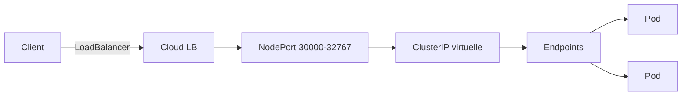
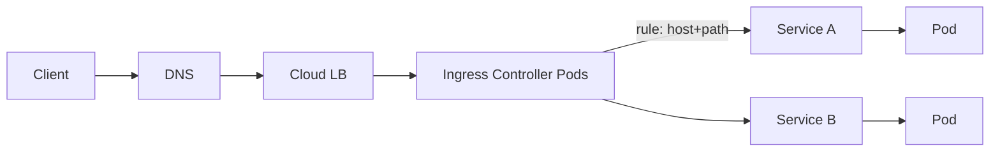

# 03 — Services & Networking

> **CKA — 20 %** · Services, Ingress, DNS, CNI, NetworkPolicy, kube-proxy modes.

## 🎯 Objectifs de l'exam

- Comprendre la connectivité Pods (**modèle réseau plat**)
- Définir et utiliser les Services (ClusterIP, NodePort, LoadBalancer)
- Configurer une **Ingress** (Ingress Controller + Ingress rules)
- Utiliser et configurer **CoreDNS**
- Choisir un **CNI plugin** approprié
- Implémenter des **NetworkPolicy**
- Comprendre le modèle **Gateway API** (successor de Ingress, GA en 1.31)

## 🧠 Concepts clés

### Le modèle réseau K8s (règles fondamentales)

1. **Chaque Pod** a une IP routable dans le cluster (pas de NAT entre Pods)
2. Un Pod peut joindre **n'importe quel autre Pod** sans NAT
3. Un agent sur un node peut joindre les Pods de ce node
4. Les Pods d'un même node partagent la même **network namespace** ? Non — **chaque Pod a son propre netns** (mais containers d'un même Pod partagent le netns via le pause container)

### Types de Services



| Type | Portée | IP | Usage |
|---|---|---|---|
| `ClusterIP` (défaut) | Interne | Virtuelle (routée par kube-proxy) | Micro-services |
| `NodePort` | Externe via node:port | Port 30000-32767 | Debug, cluster on-prem simple |
| `LoadBalancer` | Externe via cloud LB | IP publique | Prod cloud |
| `ExternalName` | Alias DNS CNAME | ø | Redirect DNS vers service externe |
| **Headless** (`clusterIP: None`) | Interne | ø | StatefulSet, gRPC direct |

#### Anatomie d'un Service `NodePort` (piège classique)

Un Service `type: NodePort` cumule **3 niveaux** :

1. **ClusterIP** virtuelle assignée automatiquement (couche interne, réutilisable pour les autres Pods)
2. **Port** dans `30000-32767` (par défaut), **ouvert sur TOUS les Worker Nodes** — pas seulement ceux qui hébergent des Pods du Service
3. **Routage** via `kube-proxy` : trafic reçu sur n'importe quel node → forwardé vers un Pod `Ready` du selector

> ⚠️ Question piège : avec `externalTrafficPolicy: Local`, le port reste **ouvert partout**, mais les nodes sans Pod du Service **droppent** le trafic. Utile pour préserver l'IP source.
>
> 💡 Multiple-choice piège :
> - "NodePort assigne un ClusterIP" → **VRAI** (nécessairement)
> - "NodePort configure un LoadBalancer cloud" → **FAUX** (c'est `type: LoadBalancer`)
> - "Port ouvert seulement sur les nodes où tournent les Pods" → **FAUX** (ouvert partout)

### Endpoints & EndpointSlices

- Un Service `matchLabels` → **Endpoints** (liste d'IPs de Pods `Ready`)
- Depuis 1.21, **EndpointSlices** (`discovery.k8s.io/v1`) = découpage en slices pour scalabilité. L'objet **`Endpoints` (v1) est désormais déprécié** (toujours supporté/lu, mais préférer EndpointSlice ; `kubectl get ep` reste OK pour un debug rapide).
- Un Pod `Not Ready` n'apparaît pas dans les endpoints (donc pas de trafic)

> 💡 Piège classique : Service sans Endpoints → **le selector ne matche aucun Pod Ready**. Vérifier avec `kubectl get ep <svc>`.

### kube-proxy — modes

| Mode | Depuis | Perf | Détail |
|---|---|---|---|
| `userspace` | ancien | ❌ | Deprecated |
| `iptables` | 1.2 | 👍 | Défaut historique ; règles linéaires O(n) |
| `ipvs` | 1.11 (GA 1.11) | 🚀 | Meilleur perf gros clusters ; requiert modules kernel `ip_vs*` |
| `nftables` | 1.29 alpha, 1.31 stable | 🚀 | Successeur d'iptables |

> 💡 **ClusterIP & `ping` selon le mode** :
> - **iptables/nftables** : la ClusterIP est une **pure règle DNAT**, bindée à aucune interface → `ping <ClusterIP>` **échoue** (pas d'hôte). `curl <ClusterIP>:<port>` marche.
> - **ipvs** : kube-proxy binde **toutes** les ClusterIP sur une interface dummy `kube-ipvs0` (IPVS exige une destination locale) → `ping` **peut** répondre, mais c'est le **host local** qui répond, **pas un Pod**. Un ping OK ne prouve **rien** sur la santé du Service.
> - Debug backends : `sudo ipvsadm -Ln` (ipvs) vs `sudo iptables-save | grep <clusterip>` (iptables).

### DNS — CoreDNS

- Deployment dans `kube-system` avec service `kube-dns` (ClusterIP)
- Résout : `<svc>.<ns>.svc.cluster.local` (A/AAAA) et `<pod-ip>.<ns>.pod.cluster.local`
- StatefulSet Pod : `<pod>.<svc-headless>.<ns>.svc.cluster.local`
- Config : ConfigMap `coredns` (Corefile)

```
.:53 {
    errors
    health { lameduck 5s }
    ready
    kubernetes cluster.local in-addr.arpa ip6.arpa { pods insecure fallthrough in-addr.arpa ip6.arpa ttl 30 }
    prometheus :9153
    forward . /etc/resolv.conf { max_concurrent 1000 }
    cache 30
    loop
    reload
    loadbalance
}
```

- `Pod.spec.dnsPolicy` : `ClusterFirst` (défaut), `Default` (utilise resolv.conf du node), `None` (+ `dnsConfig` custom)

### Ingress



- **Ingress** = ressource L7 (règles host/path → Service)
- Nécessite un **Ingress Controller** (nginx, Traefik, HAProxy, cloud provider)
- Depuis 1.19 : `apiVersion: networking.k8s.io/v1`, `pathType` **obligatoire** (`Prefix`, `Exact`, `ImplementationSpecific`)
- `IngressClass` : permet plusieurs controllers dans un même cluster

### Gateway API (2024+)

- Successeur d'Ingress, **GA en 1.31** (pour `Gateway`, `HTTPRoute`, `GatewayClass`)
- Séparation des rôles : `GatewayClass` (admin), `Gateway` (platform), `HTTPRoute` (dev)
- CKA v1.35 : **Ingress toujours attendu**, mais le cours fait désormais Gateway API **en hands-on** (NGINX Gateway Fabric). Structure : `Gateway` (listeners: port/protocol) + `HTTPRoute` (`parentRefs` → le Gateway, `hostnames`, `rules` avec `backendRefs` → Service). Officiellement borderline, mais monte en importance.

### CNI plugins

| CNI | Data plane | NetworkPolicy | eBPF |
|---|---|---|---|
| **Calico** | iptables/BGP/eBPF | ✅ (référence) | ✅ (option) |
| **Cilium** | eBPF | ✅ (L3/L4/L7) | ✅ (natif) |
| Flannel | VXLAN/host-gw | ❌ (seul) | ❌ |
| Weave | VXLAN | ✅ | ❌ |

**Sur CKA** : Calico ou Weave installés lors du bootstrap kubeadm.

### NetworkPolicy

- **Deny by default** dès qu'un Pod est **sélectionné** par au moins une NetworkPolicy `Ingress` (ou `Egress`)
- Sinon **allow all**
- Requiert un CNI qui l'implémente (⚠️ **Flannel seul ne suffit pas**)
- Sélecteurs :
  - `podSelector` : Pods dans le même namespace
  - `namespaceSelector` : namespaces cibles
  - `ipBlock` : CIDR (utile pour egress externe)

## 📋 Commandes essentielles

```bash
# --- Services ---
kubectl expose deploy web --port=80 --target-port=8080 --type=ClusterIP
kubectl create service nodeport web --tcp=80:8080 --node-port=30080 $do
kubectl get svc,ep -A
kubectl get endpointslices -A
kubectl describe svc web

# --- DNS debug ---
kubectl run test --image=busybox:1.28 --rm -it --restart=Never -- nslookup web.default
kubectl run test --image=nicolaka/netshoot --rm -it --restart=Never -- dig web.default.svc.cluster.local

# --- Ingress ---
kubectl create ingress web --rule="app.example.com/*=web:80" --class=nginx $do
kubectl get ingressclass
kubectl describe ingress web

# --- NetworkPolicy ---
kubectl get netpol -A
kubectl describe netpol <name>

# --- kube-proxy ---
kubectl -n kube-system get ds kube-proxy
kubectl -n kube-system get cm kube-proxy -o yaml | grep mode

# --- CoreDNS ---
kubectl -n kube-system get pod -l k8s-app=kube-dns
kubectl -n kube-system get cm coredns -o yaml
kubectl -n kube-system rollout restart deploy coredns

# --- Debug ---
kubectl port-forward svc/web 8080:80
kubectl port-forward pod/web-xxx 8080:80
```

## 📄 YAML de référence

```yaml
# Service ClusterIP + endpoints "manuels" (rare, utile pour cible externe)
apiVersion: v1
kind: Service
metadata: { name: web }
spec:
  selector: { app: web }
  ports:
  - port: 80
    targetPort: http                          # nom OU numéro
    protocol: TCP
---
apiVersion: v1
kind: Service                                 # ExternalName
metadata: { name: db }
spec:
  type: ExternalName
  externalName: rds.eu-west-3.amazonaws.com
```

```yaml
# Ingress avec TLS + host + path
apiVersion: networking.k8s.io/v1
kind: Ingress
metadata:
  name: web
  annotations:
    nginx.ingress.kubernetes.io/rewrite-target: /$1
spec:
  ingressClassName: nginx
  tls:
  - hosts: [app.example.com]
    secretName: web-tls                       # Secret type kubernetes.io/tls
  rules:
  - host: app.example.com
    http:
      paths:
      - path: /api/(.*)
        pathType: Prefix
        backend:
          service: { name: api, port: { number: 80 } }
      - path: /
        pathType: Prefix
        backend:
          service: { name: web, port: { number: 80 } }
```

```yaml
# NetworkPolicy — allow only from same-namespace + specific ns + external CIDR
apiVersion: networking.k8s.io/v1
kind: NetworkPolicy
metadata: { name: api-ingress, namespace: prod }
spec:
  podSelector: { matchLabels: { app: api } }
  policyTypes: [Ingress, Egress]
  ingress:
  - from:
    - podSelector: { matchLabels: { app: web } }              # même NS
    - namespaceSelector: { matchLabels: { team: monitoring } } # autre NS
    ports: [{ port: 8080, protocol: TCP }]
  egress:
  - to:
    - ipBlock: { cidr: 10.20.0.0/16, except: [10.20.5.0/24] }
    ports: [{ port: 5432 }]                    # DB externe
  - to:                                        # DNS toujours nécessaire
    - namespaceSelector: {}
      podSelector: { matchLabels: { k8s-app: kube-dns } }
    ports: [{ port: 53, protocol: UDP }]
```

```yaml
# NetworkPolicy — deny-all ingress (baseline sécurité)
apiVersion: networking.k8s.io/v1
kind: NetworkPolicy
metadata: { name: deny-all-ingress, namespace: prod }
spec:
  podSelector: {}                              # tous les Pods du NS
  policyTypes: [Ingress]                       # aucune règle ingress = deny
```

## ⚠️ Pièges fréquents

### Services
- Service **sans endpoints** = selector qui ne matche pas OU Pods `NotReady`. Toujours `kubectl get ep`.
- `NodePort` + `externalTrafficPolicy: Local` = préserve l'IP source mais si aucun Pod sur le node reçu → **drop**.
- Un Pod se référant à un Service par IP (au lieu du nom DNS) = **casse au reschedule** du service.
- **`targetPort` vs `port`** : `port` = port du service ; `targetPort` = port du container (peut être un **nom** défini dans le Pod).

### DNS
- Résolution en `A` d'un Service **Headless** → renvoie **toutes les IPs de Pods** (round-robin côté client)
- `search` du resolv.conf ajouté par K8s : `<ns>.svc.cluster.local svc.cluster.local cluster.local` — les FQDNs finis par `.` évitent la recherche.
- CoreDNS `loop` plugin détecte les loops de forward → CrashLoop si mal configuré.

### Ingress
- **Pas d'Ingress Controller = Ingress inerte**. Un `kubectl create ingress` réussit mais rien ne route.
- `pathType` non spécifié → refus API (obligatoire en v1).
- Annotations `nginx.ingress.kubernetes.io/*` sont **spécifiques** au controller nginx.

### NetworkPolicy
- **Egress DNS oublié** → l'app ne résout plus rien. Toujours autoriser UDP/53 vers CoreDNS.
- NetworkPolicy avec un **CNI non compatible** (Flannel pur) = silencieusement ignorée.
- `ipBlock` et `podSelector` sont mutuellement exclusifs dans un même élément `from`/`to`.

### kube-proxy
- Passage en mode `ipvs` nécessite `ip_vs, ip_vs_rr, ip_vs_wrr, ip_vs_sh, nf_conntrack` chargés.
- Redémarrer le DS kube-proxy après changement de mode : `k -n kube-system rollout restart ds kube-proxy`.

## 🔗 Docs officielles autorisées

- [Services](https://kubernetes.io/docs/concepts/services-networking/service/)
- [DNS for Services and Pods](https://kubernetes.io/docs/concepts/services-networking/dns-pod-service/)
- [Ingress](https://kubernetes.io/docs/concepts/services-networking/ingress/)
- [Ingress Controllers](https://kubernetes.io/docs/concepts/services-networking/ingress-controllers/)
- [Network Policies](https://kubernetes.io/docs/concepts/services-networking/network-policies/)
- [Cluster Networking](https://kubernetes.io/docs/concepts/cluster-administration/networking/)
- [Gateway API](https://gateway-api.sigs.k8s.io/) (conceptuel)
