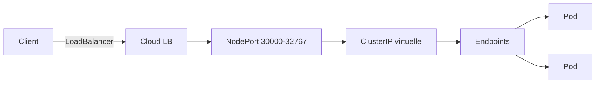
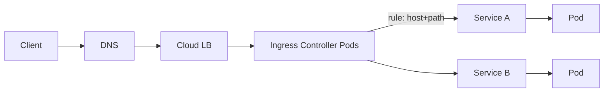
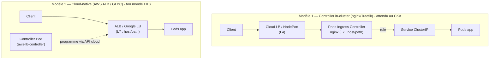
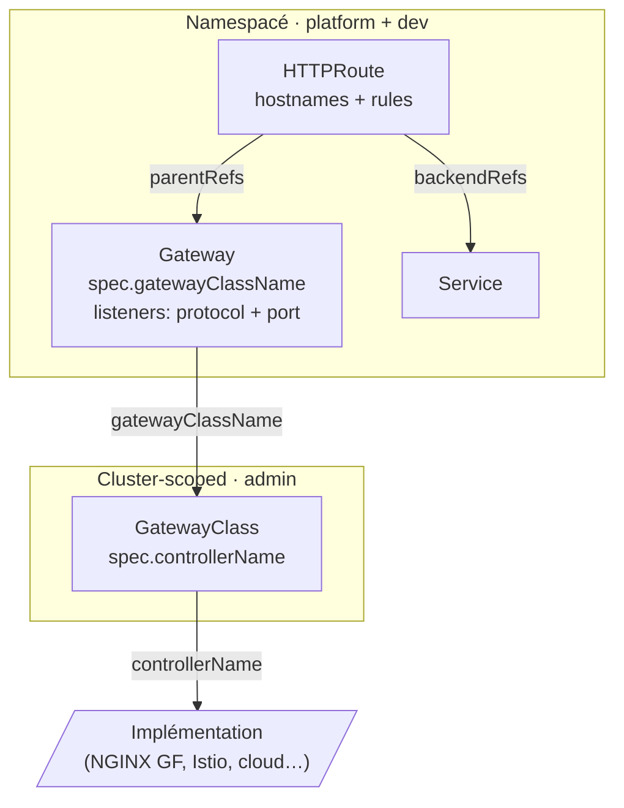

# 03 — Services & Networking

> **CKA — 20 %** · Services, Ingress, DNS, CNI, NetworkPolicy, kube-proxy modes.

<details open>
<summary>📑 Sommaire</summary>

- [🎯 Objectifs de l'exam](#-objectifs-de-lexam)
- [🧠 Concepts clés](#-concepts-clés)
  - [Le modèle réseau K8s (règles fondamentales)](#le-modèle-réseau-k8s-règles-fondamentales)
  - [Types de Services](#types-de-services)
  - [Endpoints & EndpointSlices](#endpoints--endpointslices)
  - [kube-proxy — modes](#kube-proxy--modes)
  - [DNS — CoreDNS](#dns--coredns)
  - [Ingress](#ingress)
  - [Gateway API (2024+)](#gateway-api-2024)
  - [CNI plugins](#cni-plugins)
  - [NetworkPolicy](#networkpolicy)
- [📋 Commandes essentielles](#-commandes-essentielles)
- [📄 YAML de référence](#-yaml-de-référence)
- [⚠️ Pièges fréquents](#️-pièges-fréquents)
  - [Services](#services)
  - [DNS](#dns)
  - [Ingress](#ingress-1)
  - [NetworkPolicy](#networkpolicy-1)
  - [kube-proxy](#kube-proxy)
- [🔗 Docs officielles autorisées](#-docs-officielles-autorisées)

</details>

## 🎯 Objectifs de l'exam

- Comprendre la connectivité Pods (**modèle réseau plat**)
- Définir et utiliser les Services (ClusterIP, NodePort, LoadBalancer)
- Configurer une **Ingress** (Ingress Controller + Ingress rules)
- Utiliser et configurer **CoreDNS**
- Choisir un **CNI plugin** approprié
- Implémenter des **NetworkPolicy**
- Comprendre le modèle **Gateway API** (successor de Ingress, GA en 1.31)

## 🧠 Concepts clés

### Le modèle réseau K8s (règles fondamentales)

1. **Chaque Pod** a une IP routable dans le cluster (pas de NAT entre Pods)
2. Un Pod peut joindre **n'importe quel autre Pod** sans NAT
3. Un agent sur un node peut joindre les Pods de ce node
4. Les Pods d'un même node partagent la même **network namespace** ? Non — **chaque Pod a son propre netns** (mais containers d'un même Pod partagent le netns via le pause container)

### Types de Services



| Type | Portée | IP | Usage |
|---|---|---|---|
| `ClusterIP` (défaut) | Interne | Virtuelle (routée par kube-proxy) | Micro-services |
| `NodePort` | Externe via node:port | Port 30000-32767 | Debug, cluster on-prem simple |
| `LoadBalancer` | Externe via cloud LB | IP publique | Prod cloud |
| `ExternalName` | Alias DNS CNAME | ø | Redirect DNS vers service externe |
| **Headless** (`clusterIP: None`) | Interne | ø | StatefulSet, gRPC direct |

> **Layering** : `LoadBalancer` ⊃ `NodePort` ⊃ `ClusterIP` — un Service LoadBalancer alloue **aussi** un nodePort + un ClusterIP (donc joignable via `<NodeIP>:<nodePort>` même sans LB).
>
> ⚠️ **LoadBalancer `<pending>`** : sans cloud-controller-manager (bare-metal, kubeadm nu), `EXTERNAL-IP` reste `<pending>` — le Service marche en interne comme un NodePort. Vraie IP externe on-prem → **MetalLB**. Piège de troubleshooting classique.
>
> 💡 **`kubectl proxy`** (≠ type de Service) : proxy local authentifié vers l'API pour joindre un ClusterIP depuis l'extérieur sans l'exposer → `http://localhost:8001/api/v1/namespaces/<ns>/services/<svc>:<port>/proxy/`. Debug/dev uniquement.
>
> Le **range** des ClusterIP est fixé au démarrage de l'apiserver via `--service-cluster-ip-range` ; celui des **NodePort** (`30000-32767` par défaut) via `--service-node-port-range`.

#### Anatomie d'un Service `NodePort` (piège classique)

Un Service `type: NodePort` cumule **3 niveaux** :

1. **ClusterIP** virtuelle assignée automatiquement (couche interne, réutilisable pour les autres Pods)
2. **Port** dans `30000-32767` (par défaut), **ouvert sur TOUS les Worker Nodes** — pas seulement ceux qui hébergent des Pods du Service
3. **Routage** via `kube-proxy` : trafic reçu sur n'importe quel node → forwardé vers un Pod `Ready` du selector

> ⚠️ Question piège : avec `externalTrafficPolicy: Local`, le port reste **ouvert partout**, mais les nodes sans Pod du Service **droppent** le trafic. Utile pour préserver l'IP source.
>
> 💡 Multiple-choice piège :
> - "NodePort assigne un ClusterIP" → **VRAI** (nécessairement)
> - "NodePort configure un LoadBalancer cloud" → **FAUX** (c'est `type: LoadBalancer`)
> - "Port ouvert seulement sur les nodes où tournent les Pods" → **FAUX** (ouvert partout)

#### Session affinity

- **Load balancing stateless** par défaut (round-robin/aléatoire selon le mode kube-proxy). Pour coller un client à un Pod : `spec.sessionAffinity: ClientIP` (défaut `None`) + `spec.sessionAffinityConfig.clientIP.timeoutSeconds` (défaut `10800` = 3 h).
- ⚠️ Affinité par **IP source uniquement** — **pas de cookie** (ça c'est l'Ingress L7). Derrière un proxy/NAT qui masque l'IP client → tout le trafic colle au même Pod.

#### Bascule de selector (blue/green manuel)

Éditer le `spec.selector` d'un Service **rerroute le trafic instantanément** (kube-proxy recalcule les Endpoints) :

- Pods `v1` labellisés `version: v1`, Service `selector: {app: web, version: v1}`.
- Déployer `v2` (`version: v2`) **en parallèle** → aucun trafic (non matché).
- Tester `v2`, puis `kubectl set selector svc/web 'app=web,version=v2'` → **bascule atomique**, pas de versions mixtes. Rollback = re-bascule vers `v1`.

> ⚠️ vs rolling update d'un Deployment qui **mélange** v1/v2 pendant la transition ; la bascule de selector est **tout-ou-rien**. Un selector qui ne matche plus aucun Pod `Ready` = Service **sans Endpoints** (503).

### Endpoints & EndpointSlices

- Un Service `matchLabels` → **Endpoints** (liste d'IPs de Pods `Ready`)
- Depuis 1.21, **EndpointSlices** (`discovery.k8s.io/v1`) = découpage en slices pour scalabilité. L'objet **`Endpoints` (v1) est désormais déprécié** (toujours supporté/lu, mais préférer EndpointSlice ; `kubectl get ep` reste OK pour un debug rapide).
- Un Pod `Not Ready` n'apparaît pas dans les endpoints (donc pas de trafic)

> 💡 Piège classique : Service sans Endpoints → **le selector ne matche aucun Pod Ready**. Vérifier avec `kubectl get ep <svc>`.

#### Trouver le vrai port d'écoute (troubleshoot)

Symptôme trompeur : **endpoints présents** mais `curl` refusé → le `targetPort` du Service ne tape pas le port réel d'écoute de l'appli. `containerPort` dans le manifest est **purement documentaire** et peut mentir. La seule preuve = ce que le process a `bind()` dans le Pod.

```bash
# Vérité terrain : sockets en LISTEN + process (dans le Pod)
kubectl exec <pod> -- ss -ltnp          # nginx → 0.0.0.0:80
kubectl exec <pod> -- netstat -ltnp     # fallback

# Image nue (ni ss ni netstat) : /proc en hexa (0050=80, 1F90=8080)
kubectl exec <pod> -- cat /proc/net/tcp

# Confirmation fonctionnelle
kubectl exec <pod> -- curl -s -o /dev/null -w '%{http_code}\n' localhost:80

# Image distroless : ephemeral debug container partageant le netns
kubectl debug -it <pod> --image=nicolaka/netshoot --target=<container> -- ss -ltnp
```

> ⚠️ `containerPort`, la spec du Service et la doc sont **déclaratifs** → peuvent diverger du runtime. `ss -ltnp` (ou `kubectl debug --target`) = **seule preuve directe**. Fix : `--target-port` = vrai port d'écoute (cf. piège [N9](PIEGES-EXAMEN.md)).

### kube-proxy — modes

| Mode | Depuis | Perf | Détail |
|---|---|---|---|
| `userspace` | ancien | ❌ | Deprecated |
| `iptables` | 1.2 | 👍 | Défaut historique ; règles linéaires O(n) |
| `ipvs` | 1.11 (GA 1.11) | 🚀 | Meilleur perf gros clusters ; requiert modules kernel `ip_vs*`. **Déprécié en 1.35** (migrer vers `nftables`) |
| `nftables` | 1.29 alpha, 1.31 beta, **1.33 GA** | 🚀 | Successeur d'iptables (iptables reste le **défaut** sur Linux) |

> 💡 **ClusterIP & `ping` selon le mode** :
> - **iptables/nftables** : la ClusterIP est une **pure règle DNAT**, bindée à aucune interface → `ping <ClusterIP>` **échoue** (pas d'hôte). `curl <ClusterIP>:<port>` marche.
> - **ipvs** : kube-proxy binde **toutes** les ClusterIP sur une interface dummy `kube-ipvs0` (IPVS exige une destination locale) → `ping` **peut** répondre, mais c'est le **host local** qui répond, **pas un Pod**. Un ping OK ne prouve **rien** sur la santé du Service.
> - Debug backends : `sudo ipvsadm -Ln` (ipvs) vs `sudo iptables-save | grep <clusterip>` (iptables).

> 💡 **`spec.trafficDistribution`** (Service, topology-aware routing, GA 1.33) : route le trafic vers l'endpoint le plus proche. Valeur `PreferClose` **renommée `PreferSameZone`** en 1.34 (+ ajout `PreferSameNode`) ; `PreferClose` déprécié mais conservé comme alias. Sert à réduire la latence / les coûts inter-zones (utile côté EKS multi-AZ).

### DNS — CoreDNS

- Deployment dans `kube-system` avec service `kube-dns` (ClusterIP)
- Résout : `<svc>.<ns>.svc.cluster.local` (A/AAAA) et `<pod-ip>.<ns>.pod.cluster.local`
- StatefulSet Pod : `<pod>.<svc-headless>.<ns>.svc.cluster.local`
- Config : ConfigMap `coredns` (Corefile)

```
.:53 {
    errors
    health { lameduck 5s }
    ready
    kubernetes cluster.local in-addr.arpa ip6.arpa { pods insecure fallthrough in-addr.arpa ip6.arpa ttl 30 }
    prometheus :9153
    forward . /etc/resolv.conf { max_concurrent 1000 }
    cache 30
    loop
    reload
    loadbalance
}
```

> 💡 **Recharger une modif de Corefile** : le plugin `reload` poll le fichier (~30 s + jitter), et la propagation ConfigMap→volume monté ajoute ~60-90 s (sync kubelet). Pour appliquer vite : `kubectl -n kube-system rollout restart deploy coredns` (jamais `scale 0`). `prometheus :9153` = endpoint métriques (port `9153/TCP` du Service `kube-dns`, à scraper). Plugin `rewrite` = réécrit questions/réponses DNS (`rewrite stop { name regex ... answer name ... }`).

- `Pod.spec.dnsPolicy` : `ClusterFirst` (défaut), `Default` (utilise resolv.conf du node), `None` (+ `dnsConfig` custom)

### Ingress



- **Ingress** = ressource L7 (règles host/path → Service)
- Nécessite un **Ingress Controller** (nginx, Traefik, HAProxy, cloud provider)
- Depuis 1.19 : `apiVersion: networking.k8s.io/v1`, `pathType` **obligatoire**. Trois valeurs :
  - `Prefix` : match par segments `/` (ex. `/api` matche `/api`, `/api/v1`, **pas** `/apiv1`). Le plus courant à l'exam.
  - `Exact` : match **strict** de l'URL (sensible à la casse, pas de sous-chemin).
  - `ImplementationSpecific` : le **controller décide** (nginx ≈ Prefix + regex ; GCE traite différemment). Non portable entre controllers.
- 🎨 *Test local* : `<host>.<IP>.nip.io` (ex. `ghost.192.168.99.100.nip.io`) → DNS wildcard qui résout vers `<IP>` sans config DNS. Pratique minikube, hors exam.
- `IngressClass` : permet plusieurs controllers dans un même cluster
- **Sélection du controller** : champ moderne `spec.ingressClassName: nginx` (remplace l'annotation dépréciée `kubernetes.io/ingress.class`). Une IngressClass marquée `ingressclass.kubernetes.io/is-default-class: "true"` s'applique aux Ingress **sans** `ingressClassName`.
- **Default backend** : destination **catch-all** pour les requêtes ne matchant **aucune** règle → renvoie typiquement **404**. Existe au niveau du controller (`default-http-backend`, fallback global) et au niveau d'un Ingress via `spec.defaultBackend` (backend par défaut sans `rules`). ⚠️ Un 404 sur un host/path censé exister = la requête tombe sur le default backend (règle/`host`/`pathType` KO), pas l'app.
- **Deux patterns de routing** (un même Ingress peut combiner les deux) :
  - **Name-based virtual hosting** : un `host:` distinct par règle → `a.example.com → svcA`, `b.example.com → svcB`. Le controller route sur l'en-tête `Host:`.
  - **Simple fanout (path-based)** : un **seul** `host`, plusieurs `paths` → `app.com/api → svcA`, `app.com/web → svcB`.

#### Réflexes hands-on (déploiement + test)

- **Installer un controller** (nginx) via Helm : `helm repo add ingress-nginx https://kubernetes.github.io/ingress-nginx` → `helm repo update` → `helm install myingress ingress-nginx/ingress-nginx`. Pour 1 pod par node : `values.yaml` `controller.kind: DaemonSet` (défaut = Deployment).
- Le controller expose un **Service `LoadBalancer`** (`80:<nodePort>/TCP,443:<nodePort>/TCP`). Sur kubeadm l'`EXTERNAL-IP` reste `<pending>` (pas de cloud LB) → on teste via **ClusterIP**, **IP de Pod**, ou **nodePort**.
- **🔑 Tester un Ingress name-based** : `curl -H "Host: www.example.com" http://<IP-controller>`. **Sans** le bon `Host:` → **404** (aucune règle ne matche → default backend nginx, *pas* l'app). C'est le test/debug type.
- **404 vs 503** (ingress-nginx) : **404** = aucune règle ne matche (`Host:`/path KO) → default backend. **503** = la règle **matche** mais le **backend Service n'a aucun endpoint** (Service absent, Pods `NotReady`, selector KO). Réflexe 503 → `kubectl get endpointslices -l kubernetes.io/service-name=<svc>`.
- Service **`<release>-controller-admission`** (ClusterIP:443) = ValidatingWebhook qui valide les objets `Ingress` à la création (peut bloquer un apply si la règle est invalide).

#### Deux modèles de controller (in-cluster vs cloud-native)



- **Modèle 1 (empilé)** : le LB cloud (L4) **et** les Pods nginx (L7) coexistent. Le LB **ne fait qu'amener** le trafic aux Pods du controller ; ce sont **les Pods nginx** qui lisent les `Ingress` et routent par host/path. Le LB est le **moyen d'exposer** nginx (via son Service `LoadBalancer`/`NodePort`), pas un remplaçant. **1 seul LB frontal** dessert N Ingress (l'économie vs 1 LB par app).
- **Modèle 2 (remplacement)** : le **LB cloud fait lui-même le L7**. Le controller-pod (`aws-load-balancer-controller`) ne voit **jamais** le trafic — c'est un **agent de config** (control plane) qui **programme** l'ALB via l'API cloud. Data plane = l'ALB seul.
- CKA suppose le **modèle 1** (nginx exposé en NodePort sur kubeadm). Analogie : nginx-ingress = un reverse proxy nginx dans le cluster, avec le LB devant comme un NLB devant une VM nginx.

- **Limites du spec Ingress** (→ motivent Gateway API) : HTTP/HTTPS L7 seulement. Pas de natif pour **TCP/UDP/gRPC brut**, **routing par header**, ni **canary/traffic-splitting**. Ces besoins = **annotations propres au controller** (`nginx.ingress.kubernetes.io/...`) = **vendor lock-in**. (nginx *peut* le faire via ConfigMap/annotations, mais hors spec → non portable.)

### Gateway API (2024+)

- Successeur d'Ingress, **GA en 1.31** (pour `Gateway`, `HTTPRoute`, `GatewayClass`)
- **API group** : `gateway.networking.k8s.io/v1` (⚠️ ≠ Ingress `networking.k8s.io/v1` — piège d'`apiVersion`).
- **Kinds standard** (5) : `GatewayClass`, `Gateway`, `HTTPRoute`, `GRPCRoute`, `ReferenceGrant` (ce dernier = autorise un `*Route` à référencer un backend dans **un autre namespace**).
- Séparation des rôles : `GatewayClass` (admin), `Gateway` (platform), `HTTPRoute` (dev)
- **`GatewayClass`** : **cluster-scoped** (comme `IngressClass`/`StorageClass`). Champ clé `spec.controllerName` = l'implémentation (ex. `example.com/gateway-controller`). Équivaut à `spec.controller` d'`IngressClass`. Créé par l'admin ; le dev ne fait que le référencer depuis un `Gateway`.
- **`Gateway`** : **namespacé**, la « front door ». Champ `spec.gatewayClassName` → référence la `GatewayClass`. Définit les **`listeners`** (`protocol` HTTP/HTTPS/TCP + `port`, TLS termination).
- **`HTTPRoute`** : **namespacé** (dev). `parentRefs` → Gateway, `hostnames`, `rules[].matches` (path **+ headers + query**) + `rules[].backendRefs[].name/port` → Service. ⚠️ Match path = **`matches[].path.type: PathPrefix`** (valeurs `Exact`/`PathPrefix`/`RegularExpression`) — **≠** Ingress `pathType: Prefix` (mot + champ différents). Canary natif via `backendRefs[].weight` (plus d'annotation vendor).
- CKA v1.35 : **Ingress toujours attendu**, mais le cours fait désormais Gateway API **en hands-on** (NGINX Gateway Fabric). Structure : `Gateway` (listeners: port/protocol) + `HTTPRoute` (`parentRefs` → le Gateway, `hostnames`, `rules` avec `backendRefs` → Service). Officiellement borderline, mais monte en importance.



> 🔑 Chaîne de refs (chaque niveau pointe vers le précédent) : `HTTPRoute` --parentRefs--> `Gateway` --gatewayClassName--> `GatewayClass` --controllerName--> implémentation. `HTTPRoute` --backendRefs--> `Service`.

#### Déploiement from zero (NGINX Gateway Fabric)

1. **CRDs** Gateway API (`kubectl apply .../standard-install.yaml`) → juste le vocabulaire, rien de runtime.
2. **Implémentation** (NGINX GF) → crée le **controller** (Deployment, control plane) + une **`GatewayClass` `nginx`**. ⚠️ Pas encore de proxy qui tourne.
3. Tu déploies l'**implémentation** → selon la version : soit un **nginx partagé** créé **dès l'install** (NGINX GF **1.x** : control plane + data plane **co-localisés**, 1 pod `2/2` + Service, **avant** tout `Gateway`), soit le data plane **provisionné par `Gateway`** à la demande (Istio, NGINX GF **2.x**). Vérifier : `kubectl get all -n nginx-gateway`.
4. App + `Service` ClusterIP (`kubectl expose`).
5. **`HTTPRoute`** → le controller **génère `nginx.conf`** et le pousse dans les Pods nginx.

> 🔑 **Deux Services empilés** (modèle in-cluster) : `Client → Service(LB) du Gateway → Pods nginx (L7) → Service(ClusterIP) app → Pods app`. Le proxy nginx tape **le Service** de l'app (via `backendRefs`), pas directement les Pods. ⚠️ Le **provisioning du data plane** est **implementation-specific** : nginx partagé installé en amont (NGINX GF 1.x) **ou** une instance par `Gateway` (Istio, NGINX GF 2.x).

#### Réflexes hands-on Gateway API

- **Tester** : `curl --resolve <host>:<port>:<nodeIP> http://<host>:<port>/` (mappe le hostname → IP + fixe SNI ; mieux que `-H "Host:"` en HTTPS). Hostname non matché → **404**.
- **Statut** : `kubectl get gateway` → `PROGRAMMED: True` = le controller a accepté/configuré. Changer le type du Service : `kubectl patch svc <n> -n <ns> -p '{"spec":{"type":"NodePort"}}'`.

### CNI plugins

| CNI | Data plane | NetworkPolicy | eBPF |
|---|---|---|---|
| **Calico** | iptables/BGP/eBPF | ✅ (référence) | ✅ (option) |
| **Cilium** | eBPF | ✅ (L3/L4/L7) | ✅ (natif) |
| Flannel | VXLAN/host-gw | ❌ (seul) | ❌ |
| Weave | VXLAN | ✅ | ❌ |

**Sur CKA** : Calico ou Weave installés lors du bootstrap kubeadm.

### NetworkPolicy

- **Deny by default** dès qu'un Pod est **sélectionné** par au moins une NetworkPolicy `Ingress` (ou `Egress`)
- Sinon **allow all**
- Requiert un CNI qui l'implémente (⚠️ **Flannel seul ne suffit pas**)
- Sélecteurs :
  - `podSelector` : Pods dans le même namespace
  - `namespaceSelector` : namespaces cibles
  - `ipBlock` : CIDR (utile pour egress externe)
- Les selectors acceptent `matchLabels` **ou** `matchExpressions` (opérateurs `In`/`NotIn`/`Exists`/`DoesNotExist`) — même syntaxe que partout ailleurs.

## 📋 Commandes essentielles

```bash
# --- Services ---
kubectl expose deploy web --port=80 --target-port=8080 --type=ClusterIP
kubectl create service nodeport web --tcp=80:8080 --node-port=30080 $do
kubectl get svc,ep -A
kubectl get endpointslices -A
kubectl describe svc web

# --- DNS debug ---
kubectl run test --image=busybox:1.28 --rm -it --restart=Never -- nslookup web.default
kubectl run test --image=nicolaka/netshoot --rm -it --restart=Never -- dig web.default.svc.cluster.local

# --- Ingress ---
kubectl create ingress web --rule="app.example.com/*=web:80" --class=nginx $do
kubectl get ingressclass
kubectl describe ingress web

# --- NetworkPolicy ---
kubectl get netpol -A
kubectl describe netpol <name>

# --- kube-proxy ---
kubectl -n kube-system get ds kube-proxy
kubectl -n kube-system get cm kube-proxy -o yaml | grep mode

# --- CoreDNS ---
kubectl -n kube-system get pod -l k8s-app=kube-dns
kubectl -n kube-system get cm coredns -o yaml
kubectl -n kube-system rollout restart deploy coredns

# --- Debug ---
kubectl port-forward svc/web 8080:80
kubectl port-forward pod/web-xxx 8080:80
```

## 📄 YAML de référence

```yaml
# Service ClusterIP + endpoints "manuels" (rare, utile pour cible externe)
apiVersion: v1
kind: Service
metadata: { name: web }
spec:
  selector: { app: web }
  ports:
  - port: 80
    targetPort: http                          # nom OU numéro
    protocol: TCP
---
apiVersion: v1
kind: Service                                 # ExternalName
metadata: { name: db }
spec:
  type: ExternalName
  externalName: rds.eu-west-3.amazonaws.com
```

```yaml
# Ingress avec TLS + host + path
apiVersion: networking.k8s.io/v1
kind: Ingress
metadata:
  name: web
  annotations:
    nginx.ingress.kubernetes.io/rewrite-target: /$1
spec:
  ingressClassName: nginx
  tls:
  - hosts: [app.example.com]
    secretName: web-tls                       # Secret type kubernetes.io/tls
  rules:
  - host: app.example.com
    http:
      paths:
      - path: /api/(.*)
        pathType: Prefix
        backend:
          service: { name: api, port: { number: 80 } }
      - path: /
        pathType: Prefix
        backend:
          service: { name: web, port: { number: 80 } }
```

```yaml
# NetworkPolicy — allow only from same-namespace + specific ns + external CIDR
apiVersion: networking.k8s.io/v1
kind: NetworkPolicy
metadata: { name: api-ingress, namespace: prod }
spec:
  podSelector: { matchLabels: { app: api } }
  policyTypes: [Ingress, Egress]
  ingress:
  - from:
    - podSelector: { matchLabels: { app: web } }              # même NS
    - namespaceSelector: { matchLabels: { team: monitoring } } # autre NS
    ports: [{ port: 8080, protocol: TCP }]
  egress:
  - to:
    - ipBlock: { cidr: 10.20.0.0/16, except: [10.20.5.0/24] }
    ports: [{ port: 5432 }]                    # DB externe
  - to:                                        # DNS toujours nécessaire
    - namespaceSelector: {}
      podSelector: { matchLabels: { k8s-app: kube-dns } }
    ports: [{ port: 53, protocol: UDP }]
```

```yaml
# NetworkPolicy — deny-all ingress (baseline sécurité)
apiVersion: networking.k8s.io/v1
kind: NetworkPolicy
metadata: { name: deny-all-ingress, namespace: prod }
spec:
  podSelector: {}                              # tous les Pods du NS
  policyTypes: [Ingress]                       # aucune règle ingress = deny
```

## ⚠️ Pièges fréquents

### Services
- Service **sans endpoints** = selector qui ne matche pas OU Pods `NotReady`. Toujours `kubectl get ep`.
- `NodePort` + `externalTrafficPolicy: Local` = préserve l'IP source mais si aucun Pod sur le node reçu → **drop**.
- Un Pod se référant à un Service par IP (au lieu du nom DNS) = **casse au reschedule** du service.
- **`targetPort` vs `port`** : `port` = port du service ; `targetPort` = port du container (peut être un **nom** défini dans le Pod).

### DNS
- Résolution en `A` d'un Service **Headless** → renvoie **toutes les IPs de Pods** (round-robin côté client)
- `search` du resolv.conf ajouté par K8s : `<ns>.svc.cluster.local svc.cluster.local cluster.local` — les FQDNs finis par `.` évitent la recherche.
- **`ndots:5`** (resolv.conf) : un nom avec **< 5 points** essaie d'abord tous les `search` domains → plusieurs lookups NXDOMAIN avant l'absolu. FQDN terminé par `.` = résolution directe (perf + moins de charge CoreDNS). Piège latence classique.
- CoreDNS `loop` plugin détecte les loops de forward → CrashLoop si mal configuré.

### Ingress
- **Pas d'Ingress Controller = Ingress inerte**. Un `kubectl create ingress` réussit mais rien ne route.
- `pathType` non spécifié → refus API (obligatoire en v1).
- Annotations `nginx.ingress.kubernetes.io/*` sont **spécifiques** au controller nginx.

### NetworkPolicy
- **Egress DNS oublié** → l'app ne résout plus rien. Toujours autoriser UDP/53 vers CoreDNS.
- NetworkPolicy avec un **CNI non compatible** (Flannel pur) = silencieusement ignorée.
- `ipBlock` et `podSelector` sont mutuellement exclusifs dans un même élément `from`/`to`.

### kube-proxy
- Passage en mode `ipvs` nécessite `ip_vs, ip_vs_rr, ip_vs_wrr, ip_vs_sh, nf_conntrack` chargés.
- Redémarrer le DS kube-proxy après changement de mode : `k -n kube-system rollout restart ds kube-proxy`.

## 🔗 Docs officielles autorisées

- [Services](https://kubernetes.io/docs/concepts/services-networking/service/)
- [DNS for Services and Pods](https://kubernetes.io/docs/concepts/services-networking/dns-pod-service/)
- [Ingress](https://kubernetes.io/docs/concepts/services-networking/ingress/)
- [Ingress Controllers](https://kubernetes.io/docs/concepts/services-networking/ingress-controllers/)
- [Network Policies](https://kubernetes.io/docs/concepts/services-networking/network-policies/)
- [Cluster Networking](https://kubernetes.io/docs/concepts/cluster-administration/networking/)
- [Gateway API](https://gateway-api.sigs.k8s.io/) (conceptuel)
