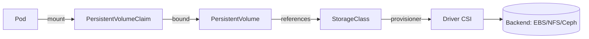
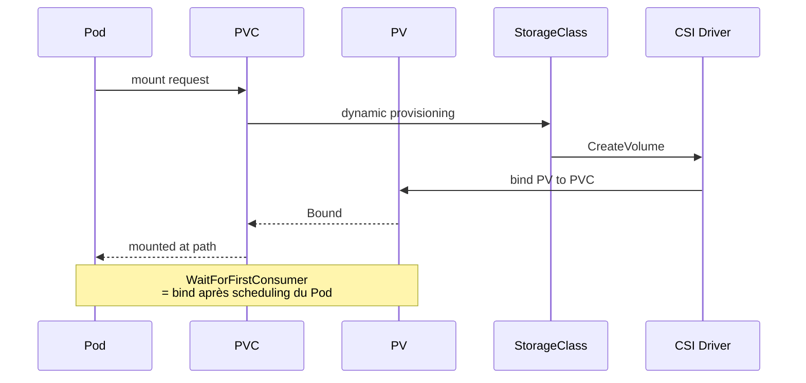

# 04 — Storage

> **CKA — 10 %** · Le domaine le plus léger en poids mais présent presque tout le temps à l'exam.

<details open>
<summary>📑 Sommaire</summary>

- [🎯 Objectifs de l'exam](#-objectifs-de-lexam)
- [🧠 Concepts clés](#-concepts-clés)
  - [Vue d'ensemble](#vue-densemble)
  - [Volume types (essentiel pour l'exam)](#volume-types-essentiel-pour-lexam)
  - [PVC — champs minimaux](#pvc--champs-minimaux)
  - [Access modes](#access-modes)
  - [Reclaim policies](#reclaim-policies)
  - [Cycle de vie : workload vs stockage](#cycle-de-vie--workload-vs-stockage)
  - [Binding & lifecycle](#binding--lifecycle)
  - [Resize d'un PVC](#resize-dun-pvc)
- [📋 Commandes essentielles](#-commandes-essentielles)
- [📄 YAML de référence](#-yaml-de-référence)
- [⚠️ Pièges fréquents](#️-pièges-fréquents)
- [🔗 Docs officielles autorisées](#-docs-officielles-autorisées)

</details>

## 🎯 Objectifs de l'exam

- Comprendre le rôle et l'usage des **classes de stockage** (`StorageClass`)
- Comprendre les **volume types**, `accessModes`, **reclaim policies**
- Comprendre les **PersistentVolumeClaim** (statiques vs dynamiques)
- Configurer des applications avec du stockage persistant

## 🧠 Concepts clés

### Vue d'ensemble



- **PV** (cluster-scoped) : représentation d'un volume physique/logique
- **PVC** (namespace-scoped) : demande d'un PV par une app
- **StorageClass** : template pour du **dynamic provisioning** (crée le PV à la demande)

### Volume types (essentiel pour l'exam)

| Type | Persistant ? | Usage |
|---|---|---|
| `emptyDir` | ❌ (durée de vie Pod) | Cache, IPC entre containers |
| `hostPath` | Node-local | ⚠️ Debug uniquement |
| `configMap` / `secret` / `downwardAPI` / `projected` | ❌ | Injection de config |
| `persistentVolumeClaim` | ✅ | Standard pour données |
| `csi` (via driver) | ✅ | Cloud/SAN/NAS |
| `nfs` (in-tree deprecated) | ✅ | Historique → utiliser CSI NFS |

> 💡 Depuis 1.28, les drivers **in-tree** (AWS EBS, GCE PD, Azure Disk, vSphere, OpenStack) sont **migrés vers CSI** (CSIMigration GA).

> 💡 `hostPath.type` : `DirectoryOrCreate`/`FileOrCreate` **créent** le chemin si absent ; `Directory`/`File` **exigent** qu'il préexiste → sinon Pod bloqué en `ContainerCreating`. Défaut `""` = aucune vérif. (Rare en tâche, utile en troubleshooting.)

> 💡 **`local` vs `hostPath`** : `local` = disque node-local **persistant**, le PV a une `nodeAffinity` **obligatoire** → le scheduler place le Pod sur le bon node. `hostPath` n'est **pas** scheduler-aware (le Pod peut atterrir sur un node où le chemin n'existe pas) → debug only.

> 💡 **`volumeMode`** : `Filesystem` (défaut, monté sur un `mountPath`) ou `Block` (device brut exposé au container via `volumeDevices`, sans FS) — raw block depuis 1.13 (EBS, Azure Disk, FC).

### PVC — champs minimaux

Un `PersistentVolumeClaim` spécifie **au minimum 2 champs obligatoires** :

| Champ | Rôle | Obligatoire |
|---|---|---|
| `spec.resources.requests.storage` | Taille demandée (`5Gi`, `100Mi`…) | ✅ |
| `spec.accessModes` | RWO / ROX / RWX / RWOP | ✅ |
| `spec.storageClassName` | Cible dynamique ou binding statique (`""`) | Optionnel (StorageClass par défaut si absent) |
| `spec.selector.matchLabels` | Filtre PVs statiques par label | Optionnel |
| `spec.volumeName` | Binding manuel sur un PV nommé | Optionnel |

> 💡 Question True/False d'exam : "un utilisateur peut spécifier size **et** access mode dans un PVC" → **VRAI**. Ce sont même les **deux champs obligatoires** du `spec`.

### Access modes

| Mode | Sigle | Sens |
|---|---|---|
| `ReadWriteOnce` | RWO | 1 seul node peut mount en RW |
| `ReadOnlyMany` | ROX | Plusieurs nodes en RO |
| `ReadWriteMany` | RWX | Plusieurs nodes en RW (NFS, CephFS, etc.) |
| `ReadWriteOncePod` | RWOP (1.29 GA) | 1 seul **Pod** en RW (plus strict que RWO) |

> ⚠️ Le mode d'accès **dépend du backend**. Un EBS ne fait que RWO. Demander RWX à un provisioner qui ne l'implémente pas = PVC `Pending`.

> ⚠️ **RWO = 1 seul _node_, PAS 1 seul Pod** (piège classique) : 2 Pods **sur le même node** peuvent partager un RWO en RW ; un Pod sur un **autre node** → `FailedAttachVolume`/`Multi-Attach error`. Pour verrouiller à **un seul Pod**, c'est `RWOP`.
> 💡 Matching PV↔PVC : Kubernetes groupe les PV par access mode, trie par **taille**, et prend le **premier PV assez grand** (≥ demande) → tu peux obtenir un PV **plus grand** que demandé.

**Exemples concrets (valide / invalide)** :

| Mode | ✅ Valide | ❌ Invalide |
|---|---|---|
| RWO | 2 Pods sur le **même node** écrivent | Pod sur un **autre node** → `FailedAttachVolume` |
| ROX | N Pods multi-nodes montent en **read-only** | un Pod tente le **RW** → refusé |
| RWX | Pods multi-nodes lisent **et** écrivent | backend ne supporte pas RWX (ex. disque cloud) → scheduling échoue |
| RWOP | **1 Pod** exclusif | 2ᵉ Pod (même node ou autre) → mount **rejeté** |

**Compatibilité mode ↔ backend (les courants)** :

| Backend | RWO | ROX | RWX |
|---|:---:|:---:|:---:|
| AWS EBS / Azure Disk / Cinder | ✅ | — | — |
| GCE PD / iSCSI / Ceph RBD | ✅ | ✅ | — |
| NFS / CephFS / AWS EFS / AzureFile / Portworx | ✅ | ✅ | ✅ |
| `hostPath` | ✅ | — | — |

> 🔑 Règle mnémo : **block storage** (EBS, Azure Disk, RBD) = attaché à **1 node** → RWO(/ROX). **File/NAS** (NFS, EFS, CephFS) = partagé réseau → **RWX**. Demander RWX à un block device = PVC `Pending`.

> ⚠️ **Piège LFS258** : les `accessModes` d'un PV **ne sont PAS appliqués** par Kubernetes — ils servent uniquement de **labels de matching** PV↔PVC (rien n'empêche techniquement 2 Pods d'écrire sur un RWO si le backend le permet). De même, un `hostPath`/chemin **inexistant** ne lève **aucune erreur à la création** du PV : seul le **Pod** qui tente de le monter échouera.

### Reclaim policies

| Policy | Effet quand PVC supprimé |
|---|---|
| `Retain` | PV conservé en état `Released` (données préservées, action manuelle nécessaire) |
| `Delete` | PV **et** volume backend supprimés (défaut pour dynamic) |
| `Recycle` | **Deprecated**, ne pas utiliser |

- Changer la policy d'un PV **live** : `kubectl patch pv <name> -p '{"spec":{"persistentVolumeReclaimPolicy":"Delete"}}'`.
- ⚠️ **NFS n'a pas de deleter plugin** : `reclaimPolicy: Delete` sur un PV NFS statique → supprimer le PVC laisse le PV en statut **`Failed`** (les backends block/cloud, eux, ont un plugin). Préférer `Retain` + nettoyage manuel.

### Cycle de vie : workload vs stockage

> Le stockage est **découplé** du workload. Supprimer/recréer un Deployment ne touche **jamais** aux PVC/PV. Seule la suppression du **PVC** (+ la `reclaimPolicy`) détruit un PV.

| Action | PVC | PV | Données |
|---|---|---|---|
| `delete deploy` (ou delete/recreate) | reste | reste | ✅ conservées |
| `delete pvc` + `reclaimPolicy: Retain` | supprimé | reste (`Released`, rebind manuel) | ✅ conservées |
| `delete pvc` + `reclaimPolicy: Delete` | supprimé | **supprimé** | ❌ volume backend effacé |

- **Ownership** : `Deployment → ReplicaSet → Pod` (cascade de delete). Le Pod **référence** le PVC (`claimName`) mais ne le **possède pas** → le PVC survit au Pod/Deployment.
- ⚠️ **StatefulSet + `volumeClaimTemplates`** : les PVC générés (`data-web-0`…) **survivent** à la suppression du STS (rétention par **défaut**) → recréer le STS récupère les données.
  - `persistentVolumeClaimRetentionPolicy` (1.27+) : `whenDeleted` / `whenScaled` = `Retain` (défaut) ou `Delete` pour opt-in à la suppression auto des PVC.

### Binding & lifecycle



- **`volumeBindingMode: Immediate`** (défaut) : PV créé dès la création du PVC
- **`WaitForFirstConsumer`** : PV créé quand le premier Pod consomme le PVC → permet au scheduler de choisir un node avant provisioning (essentiel pour zones cloud multi-AZ)

### Resize d'un PVC

- `allowVolumeExpansion: true` sur la StorageClass
- Éditer `spec.resources.requests.storage` du PVC
- Certains backends nécessitent un **restart du Pod** pour propager (`FileSystemResizePending`)

## 📋 Commandes essentielles

```bash
# --- Vue globale ---
kubectl get pv,pvc,sc -A
kubectl describe pvc data
kubectl describe pv <name>
kubectl get storageclass                   # sc
kubectl get sc -o wide                     # affiche provisioner, reclaim, expand

# --- Défaut ---
kubectl patch sc standard -p '{"metadata":{"annotations":{"storageclass.kubernetes.io/is-default-class":"true"}}}'
kubectl patch sc old -p '{"metadata":{"annotations":{"storageclass.kubernetes.io/is-default-class":"false"}}}'

# --- Debug PVC Pending ---
kubectl describe pvc <name>                # events → cause
kubectl get events --field-selector involvedObject.name=<pvc>

# --- Resize ---
kubectl edit pvc data                      # augmenter storage
kubectl get pvc data -w                    # attendre FileSystemResizeSuccessful

# --- Snapshot (nécessite driver CSI + snapshot controller) ---
kubectl get volumesnapshotclass
kubectl get volumesnapshot -A
```

## 📄 YAML de référence

```yaml
# StorageClass (dynamic provisioning, WaitForFirstConsumer, resize on)
apiVersion: storage.k8s.io/v1
kind: StorageClass
metadata:
  name: fast
  annotations:
    storageclass.kubernetes.io/is-default-class: "false"
provisioner: ebs.csi.aws.com
parameters:
  type: gp3
  encrypted: "true"
reclaimPolicy: Delete
allowVolumeExpansion: true
volumeBindingMode: WaitForFirstConsumer
```

```yaml
# PV statique (ex: NFS)
apiVersion: v1
kind: PersistentVolume
metadata: { name: nfs-share-1 }
spec:
  capacity: { storage: 10Gi }
  accessModes: [ReadWriteMany]
  persistentVolumeReclaimPolicy: Retain
  storageClassName: ""                     # "" = pas de dynamic
  nfs:
    server: nfs.internal
    path: /export/data1
```

```yaml
# PVC + Pod consommateur
apiVersion: v1
kind: PersistentVolumeClaim
metadata: { name: data, namespace: prod }
spec:
  accessModes: [ReadWriteOnce]
  resources: { requests: { storage: 5Gi } }
  storageClassName: fast
---
apiVersion: v1
kind: Pod
metadata: { name: db, namespace: prod }
spec:
  containers:
  - name: pg
    image: postgres:16
    env: [{ name: POSTGRES_PASSWORD, value: "x" }]
    volumeMounts:
    - { name: data, mountPath: /var/lib/postgresql/data }
  volumes:
  - name: data
    persistentVolumeClaim: { claimName: data }
```

```yaml
# emptyDir (partage entre containers d'un même Pod)
apiVersion: v1
kind: Pod
metadata: { name: sharing }
spec:
  containers:
  - name: writer
    image: busybox
    command: [sh, -c, "while true; do date >> /shared/log.txt; sleep 5; done"]
    volumeMounts: [{ name: shared, mountPath: /shared }]
  - name: reader
    image: busybox
    command: [sh, -c, "tail -f /shared/log.txt"]
    volumeMounts: [{ name: shared, mountPath: /shared }]
  volumes:
  - name: shared
    emptyDir: { sizeLimit: 100Mi }
```

```yaml
# projected volume (combiner secrets + configmap + downwardAPI + SA token)
apiVersion: v1
kind: Pod
metadata: { name: proj }
spec:
  containers:
  - name: c
    image: busybox
    command: [sleep, "3600"]
    volumeMounts: [{ name: all-in-one, mountPath: /etc/config }]
  volumes:
  - name: all-in-one
    projected:
      sources:
      - configMap: { name: app-cfg }
      - secret:    { name: db-creds }
      - downwardAPI:
          items:
          - path: pod-name
            fieldRef: { fieldPath: metadata.name }
      - serviceAccountToken:
          audience: vault
          expirationSeconds: 3600
          path: vault-token
```

## ⚠️ Pièges fréquents

- **PVC `Pending`** : dans l'ordre — StorageClass inexistante / pas de défaut ? `accessModes` incompatible ? Capacity du PV insuffisante ? Zone/topology contrainte ?
- **PV `Released` bloqué** : reclaim `Retain` → il faut `kubectl edit pv <name>` et retirer `spec.claimRef` pour le rendre `Available` à nouveau.
- **Modifier `storageClassName` d'un PVC = interdit** (champ immutable). Recréer.
- **`storageClassName: ""`** ≠ absence : `""` force un binding statique (pas de dynamic).
- **`volumeMounts.subPath`** utile pour monter **un fichier** de ConfigMap/Secret sans écraser le dossier, mais casse la mise à jour dynamique du ConfigMap.
- **ConfigMap/Secret — mise à jour à chaud** : injecté en **volume** = propagé automatiquement au Pod (délai ~kubelet sync, sauf `subPath`). Injecté en **env var** (`secretKeyRef`/`envFrom`) = **figé** à la création → nécessite `kubectl rollout restart` (ou recréer le Pod) pour prendre la nouvelle valeur.
- **Secret/ConfigMap en volume — mécanique & customisation** : chaque **clé → un fichier** (`mountPath/<clé>`, contenu = valeur décodée). `items:` = ne monter que **certaines clés** (+ renommer via `path`). `defaultMode`/`mode` (octal, ex `0400`) = **permissions** des fichiers. `readOnly: true` recommandé.
- **Node avec `volumeAttachments` en attente** : `k get volumeattachment` pour diagnostiquer un Pod qui ne démarre pas car son volume est encore attaché à un ancien node.
- **`emptyDir.medium: Memory`** = tmpfs, compté dans les `limits.memory` du Pod (peut causer OOMKill).
- Un **StatefulSet supprimé** ne supprime pas ses PVC. Cleanup : `kubectl delete pvc -l app=<name>`.
- **ResourceQuota storage** : `persistentvolumeclaims` (nombre) et `requests.storage` (somme des tailles demandées) sont contrôlés **à la création du PVC uniquement** — jamais rétroactivement (un quota abaissé sous l'usage courant affiche `used > hard` sans rien casser). ⚠️ **NFS : l'usage disque réel n'est PAS compté** (seul le `requests.storage` déclaré du PVC l'est). Un Deployment qui réutilise un PVC existant ne déclenche **aucun** contrôle. Contrairement au quota *compute*, le quota storage **n'exige pas** de LimitRange (piège LFS258).

## 🔗 Docs officielles autorisées

- [Persistent Volumes](https://kubernetes.io/docs/concepts/storage/persistent-volumes/)
- [Storage Classes](https://kubernetes.io/docs/concepts/storage/storage-classes/)
- [CSI drivers](https://kubernetes-csi.github.io/docs/drivers.html)
- [Volume Snapshots](https://kubernetes.io/docs/concepts/storage/volume-snapshots/)
- [Configure a Pod to use a PVC](https://kubernetes.io/docs/tasks/configure-pod-container/configure-persistent-volume-storage/)
- [Projected Volumes](https://kubernetes.io/docs/concepts/storage/projected-volumes/)
