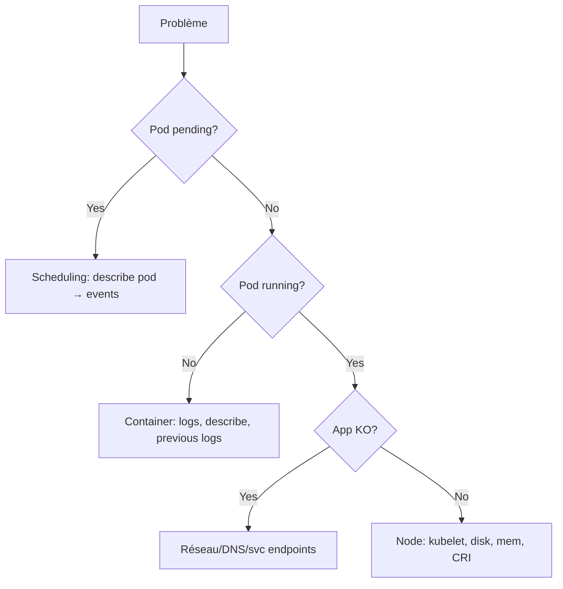

# 05 — Troubleshooting

> **CKA — 30 %** · Le domaine à **maîtriser en priorité absolue**. Beaucoup de questions "réparer un cluster/Pod cassé".

<details>
<summary>📑 Sommaire</summary>

- [🎯 Objectifs de l'exam](#-objectifs-de-lexam)
- [🧠 Concepts clés](#-concepts-clés)
  - [Méthode générale — top-down](#méthode-générale--top-down)
  - [🩺 Triage control plane — santé globale (à faire en premier)](#-triage-control-plane--santé-globale-à-faire-en-premier)
  - [Diagnostic Pod — checklist](#diagnostic-pod--checklist)
  - [États container courants](#états-container-courants)
  - [Debug node depuis le control plane](#debug-node-depuis-le-control-plane)
  - [Sur le node lui-même (SSH)](#sur-le-node-lui-même-ssh)
  - [Diagnostic réseau/DNS](#diagnostic-réseaudns)
  - [Diagnostic scheduling](#diagnostic-scheduling)
  - [metrics-server](#metrics-server)
  - [Ressource / Namespace bloqué en `Terminating`](#ressource--namespace-bloqué-en-terminating)
- [📋 Commandes essentielles](#-commandes-essentielles)
- [📄 YAML de référence](#-yaml-de-référence)
- [⚠️ Pièges fréquents](#️-pièges-fréquents)
  - [Self-healing — ce qui est vrai / faux](#self-healing--ce-qui-est-vrai--faux)
  - [Pod ne démarre pas](#pod-ne-démarre-pas)
  - [CrashLoopBackOff](#crashloopbackoff)
  - [Node NotReady](#node-notready)
  - [API server injoignable](#api-server-injoignable)
  - [DNS](#dns)
  - [Service sans trafic](#service-sans-trafic)
  - [etcd](#etcd)
- [🔗 Docs officielles autorisées](#-docs-officielles-autorisées)

</details>

## 🎯 Objectifs de l'exam

- Évaluer la santé d'un cluster et d'applications
- Diagnostiquer via **logs**, **events**, **metrics**
- Analyser les états d'un container : `Running`, `Waiting`, `Terminated`, `CrashLoopBackOff`
- Détecter les problèmes de scheduling / réseau / storage
- Utiliser `crictl` et `journalctl` sur les nodes
- Réparer un cluster cassé (etcd corrompu, cert expiré, node NotReady…)

## 🧠 Concepts clés

### Méthode générale — top-down



### 🩺 Triage control plane — santé globale (à faire en premier)

> Réflexe : avant de plonger dans un Pod, vérifier que le CP lui-même est sain. Ordre du plus global au plus fin.

```bash
# 1. L'apiserver répond-il tout court ?
kubectl version                       # timeout ici = apiserver/LB injoignable → passer en "node local" (étape 7)
kubectl get --raw='/healthz'          # "ok" attendu
kubectl get --raw='/readyz?verbose'   # détail check par check → inclut déjà [+]etcd ok (check etcd de base)
kubectl get --raw='/livez?verbose'    # apiserver vivant (≠ prêt)

# 2. Vue nodes : le CP voit-il tout le monde ?
kubectl get nodes -o wide             # tous Ready ? versions homogènes ?

# 3. Les 4 static pods du CP tournent-ils ?
kubectl -n kube-system get pods -o wide \
  -l tier=control-plane               # apiserver, etcd, scheduler, controller-manager
# ou par composant : -l component=kube-scheduler / =kube-controller-manager / =etcd

# 4. etcd — drill-down SEULEMENT si l'étape 1 montre [-]etcd failed (ou en HA, pour voir QUEL membre)
#    /readyz?verbose donne déjà le check etcd de base ; ici = détail par membre / leader / DB size
kubectl -n kube-system exec etcd-<node> -- etcdctl \
  --cacert=/etc/kubernetes/pki/etcd/ca.crt \
  --cert=/etc/kubernetes/pki/etcd/server.crt \
  --key=/etc/kubernetes/pki/etcd/server.key \
  --endpoints=https://127.0.0.1:2379 endpoint health   # + endpoint status -w table en HA

# 5. Scheduler / controller-manager vivants
#    component= possibles : kube-apiserver | etcd | kube-scheduler | kube-controller-manager
kubectl -n kube-system logs -l component=kube-scheduler --tail=20
kubectl -n kube-system logs -l component=kube-controller-manager --tail=20

# 6. Events récents à l'échelle cluster
kubectl get events -A --sort-by=.lastTimestamp | tail -20

# 7. Si apiserver injoignable → SSH sur le CP (kubectl ne marche plus) :
crictl ps -a | grep -E 'apiserver|etcd|scheduler|controller'   # containers CP up ?
ls /etc/kubernetes/manifests/                                  # les 4 manifests présents ?
journalctl -u kubelet -e | grep -i error                       # kubelet relit-il les static pods ?
sudo crictl logs <apiserver-container-id>                       # cause du crash
```

> 💡 **Logique** : `kubectl` répond → problème *dans* le cluster (étapes 2-6). `kubectl` timeout → problème *sous* le cluster (apiserver/etcd/kubelet, étape 7, en SSH). `componentstatuses` (`kubectl get cs`) donne un résumé scheduler/cm/etcd mais est **déprécié** — utiliser `/readyz?verbose` à la place.

### Diagnostic Pod — checklist

1. `kubectl describe pod <p>` → **Events** (fin du output)
2. `kubectl logs <p>` (+ `-p` pour previous crash, `-c <container>` pour multi-container)
3. `kubectl get pod <p> -o yaml` → status.conditions, containerStatuses
4. `kubectl exec -it <p> -- sh` (si Running)
5. `kubectl debug pod/<p> -it --image=busybox --target=<c>` (**ephemeral container**, K8s 1.25+ GA)

### États container courants

| State | Reason | Cause typique |
|---|---|---|
| `Waiting` | `ContainerCreating` | Attente PVC, image, ConfigMap/Secret manquant |
| `Waiting` | `ImagePullBackOff` / `ErrImagePull` | Registry, tag inexistant, secret pull |
| `Waiting` | `CrashLoopBackOff` | Container exit ≠ 0 en boucle |
| `Waiting` | `CreateContainerConfigError` | ConfigMap/Secret référencé introuvable |
| `Running` | — | OK (regarder `Ready` séparément) |
| `Terminated` | `Error` (exit 1..) | Voir logs |
| `Terminated` | `OOMKilled` (137) | Dépasse `limits.memory` |
| `Terminated` | `Completed` (0) | Fin normale (Job/init) |

### Debug node depuis le control plane

```bash
# Ephemeral debug d'un node (mount sur /host)
kubectl debug node/n1 -it --image=busybox
# → puis chroot /host pour être dans le FS du node
```

### Sur le node lui-même (SSH)

```bash
# Kubelet
systemctl status kubelet
journalctl -u kubelet -f
journalctl -u kubelet --since "10 min ago" | grep -i error
cat /var/lib/kubelet/config.yaml
cat /etc/kubernetes/kubelet.conf

# Container runtime (containerd)
systemctl status containerd
crictl ps -a
crictl logs <container-id>
crictl inspect <container-id>
crictl images
crictl pull docker.io/nginx:1.25
crictl rmi $(crictl images -q | tail -n +11)   # nettoyage

# Static pods (control plane)
ls /etc/kubernetes/manifests/
tail -f /var/log/containers/kube-apiserver-*.log

# Certificats
kubeadm certs check-expiration
openssl x509 -in /etc/kubernetes/pki/apiserver.crt -noout -dates
```

### Diagnostic réseau/DNS

```bash
# Test DNS depuis un Pod
kubectl run test --rm -it --restart=Never --image=nicolaka/netshoot -- bash
# dans le Pod :
dig kubernetes.default.svc.cluster.local
nslookup web.default
curl -v http://web.default.svc.cluster.local
cat /etc/resolv.conf

# Endpoints d'un service
kubectl get ep <svc>
kubectl get endpointslices -l kubernetes.io/service-name=<svc>

# kube-proxy
kubectl -n kube-system logs -l k8s-app=kube-proxy --tail=100
```

### Diagnostic scheduling

```bash
kubectl get events --field-selector type=Warning --sort-by=.lastTimestamp
kubectl describe pod <pending-pod>          # events → FailedScheduling raison exacte
kubectl get nodes -o wide
kubectl describe node <n>                    # Conditions, Allocatable, Taints, Non-terminated Pods
```

### metrics-server

- Fournit `kubectl top` (nodes, pods)
- Deployment dans `kube-system`
- Signes qu'il n'est **pas** installé : `error: Metrics API not available`
- 📦 **Install ≠ dans la doc autorisée** : metrics-server est un projet **SIG séparé** (`kubernetes-sigs/metrics-server`), pas documenté sur kubernetes.io — seul le repo GitHub porte le manifest (`kubectl apply -f https://github.com/kubernetes-sigs/metrics-server/releases/latest/download/components.yaml`). GitHub n'étant **pas** dans les domaines autorisés en exam, une **install from scratch est improbable au CKA**. Le cas réaliste = un metrics-server **déjà déployé mais cassé** à débugger (voir ci-dessous).
- 🔎 **metrics-server = une Aggregated API** (`v1beta1.metrics.k8s.io`), enregistrée via un objet **`APIService`**. Si `kubectl top` échoue, vérifier : `kubectl get apiservices | grep metrics` → colonne `AVAILABLE` doit être `True` (sinon `False (MissingEndpoints/...)` = pod metrics-server KO ou aggregation layer HS).
- ⭐ **Fix kubeadm récurrent — erreur TLS kubelet** : logs = `x509: cannot validate certificate ... doesn't contain any IP SANs`. metrics-server scrape le kubelet en HTTPS (port 10250) mais le certif kubelet est self-signed / sans IP SAN. Correctif :

    ```bash
    kubectl -n kube-system logs deploy/metrics-server        # confirmer l'erreur x509
    kubectl -n kube-system edit deploy metrics-server
    # sous spec.template.spec.containers[].args, ajouter :
    #   - --kubelet-insecure-tls
    ```

    TLS reste chiffré mais non vérifié → OK lab/exam, à éviter en prod (vraie solution : `serverTLSBootstrap`).

### Ressource / Namespace bloqué en `Terminating`

- Cause quasi systématique : un **finalizer** non résolu sur un objet (le controller censé le retirer est absent/HS, ex. CRD supprimée avant ses CR).
- Diagnostic : `kubectl get <res> <name> -o yaml` → regarder `metadata.finalizers` + `deletionTimestamp` (présent = suppression déjà demandée, en attente).
- Namespace coincé : trouver l'objet fautif dedans →
  `kubectl api-resources --verbs=list --namespaced -o name | xargs -n1 kubectl get -n <ns>`
- Fix propre : vider le finalizer de **l'objet** →
  `kubectl patch <res> <name> -n <ns> --type=merge -p '{"metadata":{"finalizers":[]}}'`
- ⚠️ Forcer le finalizer du **namespace** lui-même (`/finalize`) = **dernier recours** (laisse des ressources orphelines). Détail complet : cf. [PIÈGES](PIEGES-EXAMEN.md) T12.

## 📋 Commandes essentielles

```bash
# --- Vue transverse ---
kubectl get pods -A --field-selector=status.phase!=Running
kubectl get events -A --sort-by=.lastTimestamp | tail -30
kubectl get events -A --field-selector type=Warning

# --- Un Pod ---
kubectl describe pod <p>
kubectl logs <p> -c <c> --previous --tail=200
kubectl logs -f -l app=web --max-log-requests=10
kubectl exec -it <p> -c <c> -- sh
kubectl debug pod/<p> -it --image=busybox --target=<c>       # ephemeral

# --- Node ---
kubectl describe node <n>
kubectl top node
kubectl get nodes -o wide
kubectl debug node/<n> -it --image=busybox                    # chroot /host

# --- crictl (à taper directement sur le node) ---
crictl ps -a
crictl pods
crictl logs <id>
crictl inspect <id> | jq .status
crictl exec -it <id> sh

# --- API server / apiserver ---
kubectl get --raw='/healthz?verbose'
kubectl get --raw='/readyz?verbose'
kubectl get --raw='/livez?verbose'

# --- Voir les appels API sous le capot (debug auth/RBAC, URL/version réelle) ---
kubectl -v=6 get pods       # 1 ligne/requête (méthode + URL)
kubectl -v=8 get pods       # + corps requête/réponse
kubectl -v=9 get pods       # commande curl complète rejouable

# --- Certificats (control plane) ---
kubeadm certs check-expiration
kubeadm certs renew all
# puis redémarrer les static pods : mv /etc/kubernetes/manifests/*.yaml /tmp && mv back

# --- etcd health ---
ETCDCTL_API=3 etcdctl --endpoints=https://127.0.0.1:2379 \
  --cacert=/etc/kubernetes/pki/etcd/ca.crt \
  --cert=/etc/kubernetes/pki/etcd/server.crt \
  --key=/etc/kubernetes/pki/etcd/server.key endpoint health
ETCDCTL_API=3 etcdctl ... member list -w table
# HA : identifier le leader + DB size sur tous les membres
ETCDCTL_API=3 etcdctl --endpoints=https://IP1:2379,https://IP2:2379,https://IP3:2379 \
  ... endpoint status -w table          # colonne IS LEADER, VERSION, DB SIZE
```

## 📄 YAML de référence

```yaml
# Pod avec ephemeral debug container (K8s ≥ 1.25 GA)
# Ne PAS écrire ce YAML directement ; c'est kubectl debug qui le patch :
# kubectl debug pod/web -it --image=busybox --target=main --copy-to=web-debug
apiVersion: v1
kind: Pod
metadata: { name: web }
spec:
  containers:
  - { name: main, image: nginx:1.25 }
  ephemeralContainers:                       # patché à runtime
  - name: debugger
    image: busybox
    stdin: true
    tty: true
    targetContainerName: main
```

```yaml
# Sonde de liveness/readiness (souvent objet du bug)
apiVersion: v1
kind: Pod
metadata: { name: probed }
spec:
  containers:
  - name: c
    image: nginx
    startupProbe:                            # apps lentes : gèle liveness/readiness jusqu'au 1er succès → évite que liveness tue le container au boot (faux CrashLoop)
      httpGet: { path: /, port: 80 }
      failureThreshold: 30
      periodSeconds: 5
    readinessProbe:
      httpGet: { path: /, port: 80 }
      periodSeconds: 5
    livenessProbe:
      httpGet: { path: /, port: 80 }
      periodSeconds: 10
```

```yaml
# Service dont le selector NE MATCHE PAS le Pod (piège classique)
apiVersion: v1
kind: Service
metadata: { name: web }
spec:
  selector: { app: web-v1 }                  # ⚠️ Pod a label app=web → ep vide
  ports: [{ port: 80, targetPort: 80 }]
```

## ⚠️ Pièges fréquents

### Self-healing — ce qui est vrai / faux
- Un `kind: Pod` seul **NE se répare PAS**. Si le Pod meurt ou son node tombe, personne ne le recrée.
- Self-healing = propriété du **controller parent** (`Deployment`/`ReplicaSet`/`StatefulSet`/`DaemonSet`/`Job`).
- `spec.restartPolicy` (`Always`/`OnFailure`/`Never`, **défaut `Always`**) contrôle uniquement le **redémarrage d'un container** par le kubelet, **au sein du Pod encore existant**. Ne recrée pas le Pod.
- **Éviction** = K8s tue lui-même le Pod (≠ `kubectl delete`). 3 causes : **node pressure** (kubelet manque de RAM/disque/PID), **`kubectl drain`** (vidange d'un node pour maintenance), **taint `NoExecute`** (éjecte les Pods sans toleration). → avec controller : recréé ailleurs ; **bare Pod : perdu**.

> 💡 Piège d'exam : "Créez un Pod avec `restartPolicy: Always` pour self-healing" = mauvais réflexe. **Toujours** un Deployment (ou équivalent) sauf demande explicite d'un bare Pod.

### Pod ne démarre pas
- `ImagePullBackOff` : tag inexistant, registry privé sans `imagePullSecrets`, quota registry.
- `CreateContainerConfigError` : ConfigMap/Secret manquant ou clé non trouvée (attention aux **typos** dans `envFrom`/`env`).
- `Init:Error` : chercher les logs de l'**init container**, pas du container principal (`-c <init>`).
- `Pending` sur volume : `kubectl describe pvc` d'abord, pas `describe pod`.

### CrashLoopBackOff
- Backoff exponentiel : 10s → 20s → 40s… jusqu'à 5 min max.
- **Toujours `kubectl logs -p`** (`--previous`) : en CrashLoop le container courant vient de redémarrer (logs vides/partiels) → `-p` affiche les logs de l'**instance précédente qui a planté**, celle qui contient l'erreur.
- Vérifier la commande : dans le Pod, `command:` **écrase** l'`ENTRYPOINT` de l'image et `args:` **écrase** le `CMD` (Dockerfile). Un override erroné (mauvais binaire, mauvais flag) fait sortir le container aussitôt → CrashLoop. Comparer avec l'image d'origine (`docker inspect` / doc de l'image).

### Node NotReady
- 90 % des cas : `kubelet` down. Sur le node : `systemctl status kubelet` + `journalctl -u kubelet -e`.
- Causes fréquentes : disk pressure (`df -h`), memory pressure, PID exhaustion, cert expiré, cgroup driver incohérent.
- Container runtime down : `systemctl status containerd`.

### API server injoignable
- `kubectl` timeout : d'abord isoler **réseau vs process**. Ping le VIP/LB (`curl -k https://<endpoint>:6443/healthz`) → si KO = LB/route/firewall. Sur le CP : `crictl ps | grep apiserver` → si le container **manque ou restart en boucle**, le problème est le static pod (voir ligne suivante) ; s'il tourne mais répond mal, tester `kubectl get --raw='/livez?verbose'` localement.
- Static pod ne redémarre pas : bug de manifest → `journalctl -u kubelet` + `/var/log/pods/kube-system_kube-apiserver-*`.
- Cert expiré : symptôme `x509: certificate has expired or is not yet valid` dans les logs. → Vérifier : `kubeadm certs check-expiration`. Réparer : `kubeadm certs renew all` (ou un cert précis), puis **bouncer les static pods** (`mv /etc/kubernetes/manifests/*.yaml /tmp && sleep 20 && mv /tmp/*.yaml /etc/kubernetes/manifests/`). Enfin régénérer le kubeconfig admin si besoin (`kubeadm init phase kubeconfig admin` → recopier dans `$HOME/.kube/config`).

### DNS
- CoreDNS `CrashLoopBackOff` avec `plugin/loop: Loop detected` → le `resolv.conf` monté dans CoreDNS pointe sur un **résolveur local** (`127.0.0.53` = stub systemd-resolved, ou `127.0.0.1`) **au lieu d'un vrai DNS upstream** (ex. `8.8.8.8` ou le resolver du réseau). CoreDNS se forward donc à lui-même → boucle. Fix : dire au kubelet d'utiliser le vrai fichier (`--resolv-conf=/run/systemd/resolve/resolv.conf` au lieu de `/etc/resolv.conf`), puis restart CoreDNS.
- Résolution qui fonctionne dans le namespace `default` mais pas ailleurs : vérifier les `search` paths (`/etc/resolv.conf` du Pod) + le `dnsPolicy` du Pod. `dnsPolicy` = quel resolver le Pod utilise : **`ClusterFirst`** (défaut → CoreDNS, résout les services K8s), `Default` (hérite du resolv.conf du **node**, ⚠️ pas le défaut malgré le nom, ne résout PAS les services), `ClusterFirstWithHostNet` (obligatoire si `hostNetwork: true`), `None` (serveurs fournis via `dnsConfig`). Un Pod qui ne résout aucun `*.svc.cluster.local` a souvent `dnsPolicy: Default`.

### Service sans trafic
- `kubectl get ep <svc>` → vide = **selector mismatch** ou Pods `NotReady` (probes).
- `externalTrafficPolicy: Local` avec 0 Pod sur le node reçu → drop.

### etcd
- Snapshot **restore** = écrit un **nouveau data-dir** sur disque (ne touche pas le cluster live) et y forge un **nouveau cluster ID**. Donc : restaurer dans un dossier neuf est OK, mais un membre restauré **ne peut pas rejoindre** un quorum encore vivant (cluster ID mismatch) et, s'il le pouvait, les membres restés à quorum **ré-écraseraient** sa donnée. → Il faut d'abord **arrêter l'ancien cluster** :
  - **1 seul control plane (cas CKA)** : stop apiserver+etcd → `etcdctl snapshot restore snap.db --data-dir=/var/lib/etcd-restore` → repointer `--data-dir` (et le hostPath) dans le manifest static pod etcd → restart.
  - **etcd HA (3 membres)** : arrêter **tous** les membres, restaurer **le même snapshot sur chacun** avec `--initial-cluster` / `--initial-cluster-token` cohérents, puis relancer les 3 = cluster reconstruit à neuf.
- Après restore, il faut modifier le manifest static pod etcd pour pointer vers le nouveau `--data-dir`.

## 🔗 Docs officielles autorisées

- [Troubleshooting Applications](https://kubernetes.io/docs/tasks/debug/debug-application/)
- [Debug Pods](https://kubernetes.io/docs/tasks/debug/debug-application/debug-pods/)
- [Debug Services](https://kubernetes.io/docs/tasks/debug/debug-application/debug-service/)
- [Debug Running Pods (ephemeral)](https://kubernetes.io/docs/tasks/debug/debug-application/debug-running-pod/)
- [Debug Cluster](https://kubernetes.io/docs/tasks/debug/debug-cluster/)
- [Debug Cluster DNS](https://kubernetes.io/docs/tasks/administer-cluster/dns-debugging-resolution/)
- [crictl](https://kubernetes.io/docs/tasks/debug/debug-cluster/crictl/)
- [Restore etcd cluster](https://kubernetes.io/docs/tasks/administer-cluster/configure-upgrade-etcd/#restoring-an-etcd-cluster)
