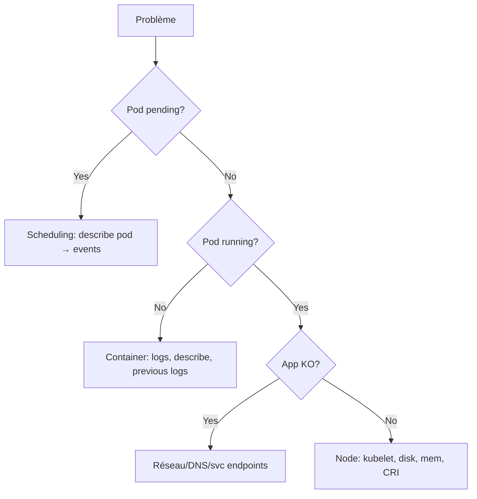

# 05 — Troubleshooting

> **CKA — 30 %** · Le domaine à **maîtriser en priorité absolue**. Beaucoup de questions "réparer un cluster/Pod cassé".

## 🎯 Objectifs de l'exam

- Évaluer la santé d'un cluster et d'applications
- Diagnostiquer via **logs**, **events**, **metrics**
- Analyser les états d'un container : `Running`, `Waiting`, `Terminated`, `CrashLoopBackOff`
- Détecter les problèmes de scheduling / réseau / storage
- Utiliser `crictl` et `journalctl` sur les nodes
- Réparer un cluster cassé (etcd corrompu, cert expiré, node NotReady…)

## 🧠 Concepts clés

### Méthode générale — top-down



### Diagnostic Pod — checklist

1. `kubectl describe pod <p>` → **Events** (fin du output)
2. `kubectl logs <p>` (+ `-p` pour previous crash, `-c <container>` pour multi-container)
3. `kubectl get pod <p> -o yaml` → status.conditions, containerStatuses
4. `kubectl exec -it <p> -- sh` (si Running)
5. `kubectl debug pod/<p> -it --image=busybox --target=<c>` (**ephemeral container**, K8s 1.25+ GA)

### États container courants

| State | Reason | Cause typique |
|---|---|---|
| `Waiting` | `ContainerCreating` | Attente PVC, image, ConfigMap/Secret manquant |
| `Waiting` | `ImagePullBackOff` / `ErrImagePull` | Registry, tag inexistant, secret pull |
| `Waiting` | `CrashLoopBackOff` | Container exit ≠ 0 en boucle |
| `Waiting` | `CreateContainerConfigError` | ConfigMap/Secret référencé introuvable |
| `Running` | — | OK (regarder `Ready` séparément) |
| `Terminated` | `Error` (exit 1..) | Voir logs |
| `Terminated` | `OOMKilled` (137) | Dépasse `limits.memory` |
| `Terminated` | `Completed` (0) | Fin normale (Job/init) |

### Debug node depuis le control plane

```bash
# Ephemeral debug d'un node (mount sur /host)
kubectl debug node/n1 -it --image=busybox
# → puis chroot /host pour être dans le FS du node
```

### Sur le node lui-même (SSH)

```bash
# Kubelet
systemctl status kubelet
journalctl -u kubelet -f
journalctl -u kubelet --since "10 min ago" | grep -i error
cat /var/lib/kubelet/config.yaml
cat /etc/kubernetes/kubelet.conf

# Container runtime (containerd)
systemctl status containerd
crictl ps -a
crictl logs <container-id>
crictl inspect <container-id>
crictl images
crictl pull docker.io/nginx:1.25
crictl rmi $(crictl images -q | tail -n +11)   # nettoyage

# Static pods (control plane)
ls /etc/kubernetes/manifests/
tail -f /var/log/containers/kube-apiserver-*.log

# Certificats
kubeadm certs check-expiration
openssl x509 -in /etc/kubernetes/pki/apiserver.crt -noout -dates
```

### Diagnostic réseau/DNS

```bash
# Test DNS depuis un Pod
kubectl run test --rm -it --restart=Never --image=nicolaka/netshoot -- bash
# dans le Pod :
dig kubernetes.default.svc.cluster.local
nslookup web.default
curl -v http://web.default.svc.cluster.local
cat /etc/resolv.conf

# Endpoints d'un service
kubectl get ep <svc>
kubectl get endpointslices -l kubernetes.io/service-name=<svc>

# kube-proxy
kubectl -n kube-system logs -l k8s-app=kube-proxy --tail=100
```

### Diagnostic scheduling

```bash
kubectl get events --field-selector type=Warning --sort-by=.lastTimestamp
kubectl describe pod <pending-pod>          # events → FailedScheduling raison exacte
kubectl get nodes -o wide
kubectl describe node <n>                    # Conditions, Allocatable, Taints, Non-terminated Pods
```

### metrics-server

- Fournit `kubectl top` (nodes, pods)
- Deployment dans `kube-system`
- Signes qu'il n'est **pas** installé : `error: Metrics API not available`
- ⭐ **Fix kubeadm récurrent — erreur TLS kubelet** : logs = `x509: cannot validate certificate ... doesn't contain any IP SANs`. metrics-server scrape le kubelet en HTTPS (port 10250) mais le certif kubelet est self-signed / sans IP SAN. Correctif :

    ```bash
    kubectl -n kube-system logs deploy/metrics-server        # confirmer l'erreur x509
    kubectl -n kube-system edit deploy metrics-server
    # sous spec.template.spec.containers[].args, ajouter :
    #   - --kubelet-insecure-tls
    ```

    TLS reste chiffré mais non vérifié → OK lab/exam, à éviter en prod (vraie solution : `serverTLSBootstrap`).

## 📋 Commandes essentielles

```bash
# --- Vue transverse ---
kubectl get pods -A --field-selector=status.phase!=Running
kubectl get events -A --sort-by=.lastTimestamp | tail -30
kubectl get events -A --field-selector type=Warning

# --- Un Pod ---
kubectl describe pod <p>
kubectl logs <p> -c <c> --previous --tail=200
kubectl logs -f -l app=web --max-log-requests=10
kubectl exec -it <p> -c <c> -- sh
kubectl debug pod/<p> -it --image=busybox --target=<c>       # ephemeral

# --- Node ---
kubectl describe node <n>
kubectl top node
kubectl get nodes -o wide
kubectl debug node/<n> -it --image=busybox                    # chroot /host

# --- crictl (à taper directement sur le node) ---
crictl ps -a
crictl pods
crictl logs <id>
crictl inspect <id> | jq .status
crictl exec -it <id> sh

# --- API server / apiserver ---
kubectl get --raw='/healthz?verbose'
kubectl get --raw='/readyz?verbose'
kubectl get --raw='/livez?verbose'

# --- Voir les appels API sous le capot (debug auth/RBAC, URL/version réelle) ---
kubectl -v=6 get pods       # 1 ligne/requête (méthode + URL)
kubectl -v=8 get pods       # + corps requête/réponse
kubectl -v=9 get pods       # commande curl complète rejouable

# --- Certificats (control plane) ---
kubeadm certs check-expiration
kubeadm certs renew all
# puis redémarrer les static pods : mv /etc/kubernetes/manifests/*.yaml /tmp && mv back

# --- etcd health ---
ETCDCTL_API=3 etcdctl --endpoints=https://127.0.0.1:2379 \
  --cacert=/etc/kubernetes/pki/etcd/ca.crt \
  --cert=/etc/kubernetes/pki/etcd/server.crt \
  --key=/etc/kubernetes/pki/etcd/server.key endpoint health
ETCDCTL_API=3 etcdctl ... member list -w table
```

## 📄 YAML de référence

```yaml
# Pod avec ephemeral debug container (K8s ≥ 1.25 GA)
# Ne PAS écrire ce YAML directement ; c'est kubectl debug qui le patch :
# kubectl debug pod/web -it --image=busybox --target=main --copy-to=web-debug
apiVersion: v1
kind: Pod
metadata: { name: web }
spec:
  containers:
  - { name: main, image: nginx:1.25 }
  ephemeralContainers:                       # patché à runtime
  - name: debugger
    image: busybox
    stdin: true
    tty: true
    targetContainerName: main
```

```yaml
# Sonde de liveness/readiness (souvent objet du bug)
apiVersion: v1
kind: Pod
metadata: { name: probed }
spec:
  containers:
  - name: c
    image: nginx
    startupProbe:                            # démarrages lents : ping avant l'activation des autres
      httpGet: { path: /, port: 80 }
      failureThreshold: 30
      periodSeconds: 5
    readinessProbe:
      httpGet: { path: /, port: 80 }
      periodSeconds: 5
    livenessProbe:
      httpGet: { path: /, port: 80 }
      periodSeconds: 10
```

```yaml
# Service dont le selector NE MATCHE PAS le Pod (piège classique)
apiVersion: v1
kind: Service
metadata: { name: web }
spec:
  selector: { app: web-v1 }                  # ⚠️ Pod a label app=web → ep vide
  ports: [{ port: 80, targetPort: 80 }]
```

## ⚠️ Pièges fréquents

### Self-healing — ce qui est vrai / faux
- Un `kind: Pod` seul **NE se répare PAS**. Si le Pod meurt ou son node tombe, personne ne le recrée.
- Self-healing = propriété du **controller parent** (`Deployment`/`ReplicaSet`/`StatefulSet`/`DaemonSet`/`Job`).
- `spec.restartPolicy` (`Always`/`OnFailure`/`Never`) contrôle uniquement le **redémarrage d'un container** par le kubelet, **au sein du Pod encore existant**. Ne recrée pas le Pod.
- Éviction (node pressure, drain, taint `NoExecute`) tue le Pod ; sans controller → perdu.

> 💡 Piège d'exam : "Créez un Pod avec `restartPolicy: Always` pour self-healing" = mauvais réflexe. **Toujours** un Deployment (ou équivalent) sauf demande explicite d'un bare Pod.

### Pod ne démarre pas
- `ImagePullBackOff` : tag inexistant, registry privé sans `imagePullSecrets`, quota registry.
- `CreateContainerConfigError` : ConfigMap/Secret manquant ou clé non trouvée (attention aux **typos** dans `envFrom`/`env`).
- `Init:Error` : chercher les logs de l'**init container**, pas du container principal (`-c <init>`).
- `Pending` sur volume : `kubectl describe pvc` d'abord, pas `describe pod`.

### CrashLoopBackOff
- Backoff exponentiel : 10s → 20s → 40s… jusqu'à 5 min max.
- **Toujours `kubectl logs -p`** (previous instance).
- Vérifier la commande : `command:` **remplace** l'ENTRYPOINT ; `args:` remplace le CMD.

### Node NotReady
- 90 % des cas : `kubelet` down. Sur le node : `systemctl status kubelet` + `journalctl -u kubelet -e`.
- Causes fréquentes : disk pressure (`df -h`), memory pressure, PID exhaustion, cert expiré, cgroup driver incohérent.
- Container runtime down : `systemctl status containerd`.

### API server injoignable
- `kubectl` timeout : ping le VIP/LB. Sur le CP : `crictl ps | grep apiserver`.
- Static pod ne redémarre pas : bug de manifest → `journalctl -u kubelet` + `/var/log/pods/kube-system_kube-apiserver-*`.
- Cert expiré : symptôme "x509: certificate has expired" dans les logs.

### DNS
- CoreDNS `CrashLoopBackOff` avec `plugin/loop: Loop detected` → `resolv.conf` du node pointe sur lui-même.
- Résolution qui fonctionne dans le namespace `default` mais pas ailleurs : vérifier `search` paths + `dnsPolicy`.

### Service sans trafic
- `kubectl get ep <svc>` → vide = **selector mismatch** ou Pods `NotReady` (probes).
- `externalTrafficPolicy: Local` avec 0 Pod sur le node reçu → drop.

### etcd
- Snapshot **restore** fait sur **1 seul membre** puis nouveau cluster init. Ne pas restore sur un cluster à quorum encore actif.
- Après restore, il faut modifier le manifest static pod etcd pour pointer vers le nouveau `--data-dir`.

## 🔗 Docs officielles autorisées

- [Troubleshooting Applications](https://kubernetes.io/docs/tasks/debug/debug-application/)
- [Debug Pods](https://kubernetes.io/docs/tasks/debug/debug-application/debug-pods/)
- [Debug Services](https://kubernetes.io/docs/tasks/debug/debug-application/debug-service/)
- [Debug Running Pods (ephemeral)](https://kubernetes.io/docs/tasks/debug/debug-application/debug-running-pod/)
- [Debug Cluster](https://kubernetes.io/docs/tasks/debug/debug-cluster/)
- [Debug Cluster DNS](https://kubernetes.io/docs/tasks/administer-cluster/dns-debugging-resolution/)
- [crictl](https://kubernetes.io/docs/tasks/debug/debug-cluster/crictl/)
- [Restore etcd cluster](https://kubernetes.io/docs/tasks/administer-cluster/configure-upgrade-etcd/#restoring-an-etcd-cluster)
